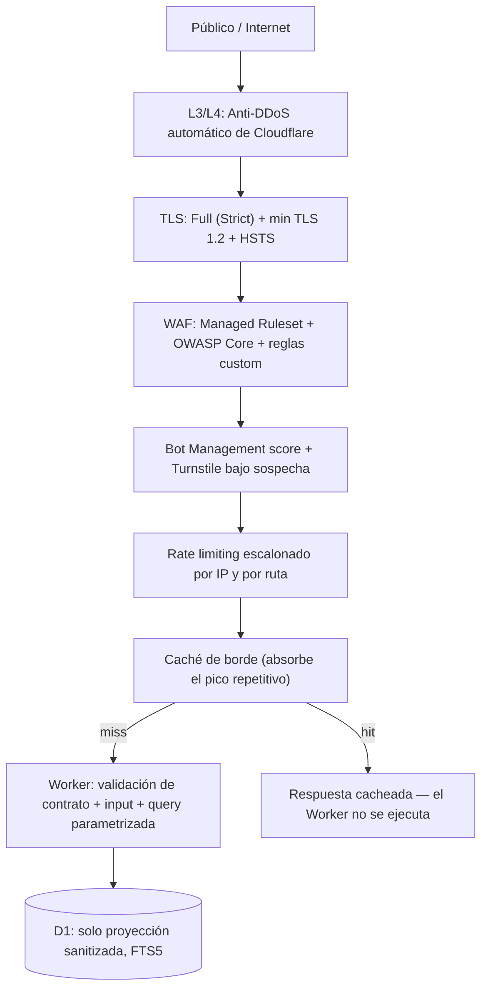

# ADR 0002 — Endurecimiento de seguridad del plano público con Cloudflare

| Campo | Valor |
|---|---|
| Estado | Propuesta |
| Fecha | 2026-06-28 |
| Decisores | Infraestructura, DB/API, Scrapers/Cleaners |
| Reemplaza a | — |
| Complementa | `docs/adr/0001-arquitectura-serving-publico.md` |
| Relacionado con | `docs/pipeline.md §14`, `docs/schema.md` (Vista pública), `docs/base-standards.md §10`, `docs/implementation-plan.md` Fase 4 |

---

## 1. Contexto

La ADR 0001 fijó la arquitectura de **dos planos**: un plano interno (Supabase /
PostgreSQL, fuente de verdad con datos completos) y un **plano público de
solo-lectura** servido desde el borde de Cloudflare (Worker + D1 con la
proyección sanitizada). Esa ADR enumeró los controles de borde —WAF, caché,
rate-limit, Turnstile— pero solo a alto nivel (§8 y §12.4).

Esta ADR **no reabre** la decisión arquitectónica de la 0001: la **implementa y
la endurece**. Concreta *cómo* se configura cada control de Cloudflare, en qué
orden actúan, qué amenazas mitiga cada uno y qué queda como configuración
versionada. El objetivo declarado por el equipo: **proteger el API tanto como sea
posible con Cloudflare**, asumiendo un contexto de crisis donde:

1. El dato sirve a personas vulnerables (PII como riesgo existencial).
2. El tráfico llega en picos extremos y repetitivos.
3. El presupuesto es ~0; los controles deben caber en el plan gratuito o casi.

> Regla de oro heredada (`docs/README.md`): *Duplicar es tolerable. Perder
> trazabilidad no. Exponer PII no. El plano público no posee datos en claro.*

---

## 2. Modelo de amenazas

Diseñar seguridad sin nombrar al adversario produce controles decorativos. Para
este sistema los actores y sus objetivos son:

| Actor | Objetivo | Capacidad |
|---|---|---|
| **Scraper masivo** | Reconstruir la base completa de personas para revender/cruzar | Alta: rota IPs, paraleliza, parsea HTML/JSON |
| **Verificador de identidades** | Confirmar si una cédula concreta está en la base (doxxing, extorsión) | Media: consultas dirigidas por cédula |
| **Atacante de disponibilidad** | Tumbar la búsqueda durante una réplica sísmica (cuando más se necesita) | Media-alta: DDoS L3/4/7 |
| **Atacante de inyección** | Leer/corromper D1 o filtrar campos no proyectados | Media: SQLi, path traversal, abuso de parámetros |
| **Insider / fuga de secreto** | Acceder al plano interno (Supabase) o al token de publicación a D1 | Variable |

Activos a proteger, por valor:

1. **PII en claro** (cédulas, teléfonos, contacto, ubicación exacta de menores).
   Vive **solo** en el plano interno. *Nunca* debe alcanzarse desde el borde.
2. **Disponibilidad del API** de búsqueda durante el pico de crisis.
3. **Integridad del artefacto D1** (que nadie lo modifique fuera del build job).
4. **Secretos**: `PII_HMAC_SECRET`, credenciales Supabase, token Cloudflare.

Principio de **blast-radius**: una brecha total del plano público expone, en el
peor caso, datos **ya sanitizados** (ADR 0001 §5). El endurecimiento de esta ADR
busca que ni siquiera eso sea trivial de cosechar en masa.

---

## 3. Decisión — Defensa en profundidad en el borde

Se adopta una cadena de control en capas. Cada petición del público atraviesa,
**en este orden**, los siguientes filtros antes de tocar lógica de aplicación.
Una petición rechazada en una capa temprana nunca consume las siguientes (ni
cómputo del Worker, ni lecturas de D1).



**Lema de diseño:** *el origen no existe para el público.* No hay IP de origen
que atacar (Workers se ejecuta en el borde), no hay base transaccional expuesta,
y el dato sensible físicamente no está en este plano.

---

## 4. Detalle por capa

### 4.1 Zona, DNS y exposición

* La zona del dominio vive en Cloudflare. **Todo** registro público va en modo
  **proxy (nube naranja)**: nunca DNS-only. Así no se filtra ninguna IP de origen.
* El API se publica mediante una **ruta de Worker** (`api.<dominio>/v1/*`), no un
  registro `A/AAAA` hacia un servidor. No hay origen TCP que escanear.
* `wrangler.toml` declara la ruta y el binding a D1; el Worker es el único
  ejecutable con acceso a la base.
* Se deshabilitan métodos no usados: el API es solo-lectura → solo `GET`,
  `HEAD`, `OPTIONS`. Cualquier otro método se rechaza en WAF (§4.4).

### 4.2 TLS y transporte

| Control | Valor | Por qué |
|---|---|---|
| Modo SSL/TLS | **Full (Strict)** | Cifrado extremo a extremo y validación de cert |
| Versión mínima TLS | **1.2** (preferir 1.3) | Elimina downgrade a protocolos rotos |
| HSTS | `max-age=31536000; includeSubDomains; preload` | Fuerza HTTPS, previene SSL-strip |
| Always Use HTTPS | On | Redirige 301 cualquier `http://` |
| Authenticated Origin Pulls / mTLS | N/A para Workers (sin origen), **sí** para cualquier fallback a Alternativa B (R2/origen) | Solo Cloudflare puede hablar con el origen |
| Certificate Transparency Monitoring | On | Detecta emisión de certs no autorizados para el dominio |

### 4.3 Capa de red (L3/L4)

* **Protección DDoS automática** de Cloudflare (incluida en el plan gratuito):
  mitiga inundaciones SYN/UDP/ACK sin configuración. Como el público solo llega
  por HTTPS proxeado, el resto del espectro de puertos no está expuesto.
* No se publica ningún puerto de origen → la superficie L3/L4 atacable es la de
  la red de Cloudflare, no la nuestra.

### 4.4 WAF — Web Application Firewall

Tres niveles, de genérico a específico:

1. **Cloudflare Managed Ruleset**: protecciones mantenidas por Cloudflare contra
   CVEs y patrones de ataque conocidos. Modo *block*.
2. **OWASP Core Ruleset**: cobertura SQLi, XSS, RCE, LFI/RFI. Umbral de
   *paranoia* moderado al inicio (evita falsos positivos), endurecible con datos.
3. **Reglas custom** (expresadas como código, §7). Ejemplos de intención:

```text
# Solo métodos de lectura en el API
(http.request.uri.path contains "/v1/" and not http.request.method in {"GET" "HEAD" "OPTIONS"})
    → block

# Bloquear user-agents de scraping conocidos y clientes sin UA
(http.user_agent eq "" or http.user_agent contains "python-requests"
    or http.user_agent contains "curl" or http.user_agent contains "scrapy")
    → managed_challenge

# Limitar tamaño de query string (anti-abuso / anti-DoS de parser)
(len(http.request.uri.query) > 256)
    → block

# Bloquear rutas que no existen en el contrato v1 (reduce fuzzing)
(starts_with(http.request.uri.path, "/v1/") and not
    http.request.uri.path in {"/v1/personas" "/v1/acopio" "/v1/events"})
    → block
```

> Nota: las reglas anti user-agent usan `managed_challenge` (no `block`) para no
> castigar a integradores legítimos por error; un humano/cliente real lo resuelve.

### 4.5 Bot Management y Turnstile

* **Bot score** de Cloudflare en cada request `/v1/*`. Score bajo (probable bot)
  → `managed_challenge`.
* **Turnstile** (CAPTCHA sin fricción de Cloudflare) se exige cuando se cumplen
  patrones sospechosos: ráfaga de consultas distintas desde una IP, score de bot
  bajo, o búsqueda por cédula (§6). El token de Turnstile se valida en el Worker
  antes de tocar D1.
* Objetivo: un humano buscando a un familiar pasa sin fricción; un cosechador
  automatizado choca contra el desafío en cuanto su patrón se delata.

### 4.6 Rate limiting escalonado

Límites por IP y por ruta, crecientes en severidad. Valores iniciales (a calibrar
con métricas reales):

| Alcance | Límite | Acción | Razón |
|---|---|---|---|
| Global `/v1/*` por IP | 60 req / min | `managed_challenge` | Uso humano normal cabe holgado |
| `/v1/personas` por IP | 20 req / min | `block` 1 min | La búsqueda de personas es el objetivo de enumeración |
| Búsqueda por `cedula_hmac` por IP | 5 req / min | `block` + Turnstile | Anti-verificación masiva de identidades (§6) |
| Ráfaga sostenida (cualquier ruta) | 600 req / 5 min | `block` 10 min | Corta scraping distribuido lento |

El rate-limit vive en el borde: una ráfaga bloqueada **no** ejecuta el Worker ni
lee D1, así que no consume cuota ni cómputo.

### 4.7 Caché — el control que sostiene el pico

El workload es lectura-dominante y **muy repetitivo** (los mismos nombres/zonas
que están en las noticias). La caché de borde es a la vez una optimización de
costo y un **control de disponibilidad**:

* `Cache-Control: public, max-age=120` en respuestas de búsqueda (ADR 0001 §6).
* **Tiered Cache** activado: concentra los miss en menos nodos de origen-Worker.
* **Cache key** normalizada: ordenar parámetros y bajar a minúsculas el término
  de búsqueda para maximizar el hit-rate de consultas equivalentes.
* `/healthz` no se cachea.
* Hit-rate esperado >95% en pico → el Worker recibe una fracción del tráfico y un
  intento de DDoS L7 contra términos populares se sirve desde caché.

### 4.8 Validación del contrato del request

El contrato v1 (ADR 0001 §6) está hoy definido como **prosa**, no como una
especificación formal: el repo **no usa OpenAPI/Swagger** ni FastAPI (los stubs
`api/*` están vacíos; el serving será un Worker delgado en TypeScript, ADR 0001
§3.4 y §12). Por eso la validación del request se hace con lo que ya está en el
plan de implementación, sin introducir tooling nuevo:

* **Validación en el Worker** (`docs/implementation-plan.md` Fase 3): rechaza
  parámetros no declarados, tipos inválidos y longitudes fuera de rango; hace
  cumplir `nombre` ≥ 3 caracteres y el tope de 20 resultados. Es la fuente de
  verdad del contrato.
* **Reglas WAF custom** (§4.4) como primera barrera en el borde: rutas allowlist,
  métodos de lectura y tamaño de query string. Filtran el grueso del fuzzing antes
  de ejecutar el Worker.

> **Mejora opcional futura (no en uso):** si más adelante se formaliza el contrato
> como un `serving/openapi.yaml`, se puede activar **API Shield schema validation**
> de Cloudflare para validar el request contra ese schema en el borde. No es
> requisito de esta ADR; es un endurecimiento adicional sobre la validación del
> Worker, no un reemplazo.

### 4.9 Headers de seguridad de respuesta

El Worker (o una Transform Rule de Cloudflare) añade en todas las respuestas:

```text
Strict-Transport-Security: max-age=31536000; includeSubDomains; preload
Content-Security-Policy: default-src 'none'; frame-ancestors 'none'
X-Content-Type-Options: nosniff
X-Frame-Options: DENY
Referrer-Policy: no-referrer
Cross-Origin-Resource-Policy: same-origin
Permissions-Policy: geolocation=(), camera=(), microphone=()
Cache-Control: public, max-age=120   # salvo /healthz
```

CORS: por defecto **denegado**. Si una UI pública oficial necesita consumir el
API, se habilita `Access-Control-Allow-Origin` **solo** para ese origen
explícito, nunca `*`.

### 4.10 Worker — controles de aplicación

Aunque el borde filtra la mayoría, el Worker no confía en nada:

* **Queries siempre parametrizadas** (`.bind()`), jamás interpolación de strings
  en SQL → anti-inyección incluso si una regla WAF falla (`docs/implementation-plan.md`
  Fase 3, `query.ts`).
* **Allowlist de parámetros**: solo se leen los del contrato; el resto se ignora.
* **Sin "listar todo"**, sin paginación profunda, máx. 20 resultados por respuesta
  (ADR 0001 §6) → la enumeración total es inviable por diseño.
* El Worker solo puede leer la proyección sanitizada en D1; **no tiene binding ni
  credencial** hacia Supabase ni hacia ningún dato en claro.
* Manejo de error genérico: nunca devolver stack traces, nombres de tabla ni
  detalles internos en la respuesta.

### 4.11 Búsqueda por cédula — anti-verificación masiva (refuerza ADR 0001 §8)

* El `cedula_hmac` se computa **server-side** en el Worker con `PII_HMAC_SECRET`;
  el cliente nunca envía ni recibe el HMAC crudo de forma que permita precómputo.
* **No se confirma existencia a ciegas**: la búsqueda por cédula exige combinarla
  con otro campo (p. ej. estado o nombre parcial) → no sirve como oráculo de
  "¿existe esta cédula?".
* Rate-limit dedicado y Turnstile obligatorio en este camino (§4.6).
* **Cero logging** del HMAC, de la cédula y del término de búsqueda sensible.

### 4.12 Secretos y logging sin PII

* `PII_HMAC_SECRET` se guarda como **Worker Secret** cifrado (`wrangler secret put`),
  nunca en `wrangler.toml`, nunca en el repo. Mismo valor que el pipeline para que
  el lookup por cédula sea consistente.
* Token de Cloudflare, `SUPABASE_DB_URL` y `D1_DATABASE_ID` viven en GitHub Actions
  Secrets (los usa el build job), no en el borde público.
* **Logpush / logs del Worker sin PII**: se extiende `docs/pipeline.md §14` al API.
  Prohibido loguear query strings con cédulas o nombres completos. Se loguea ruta,
  status, latencia, código de caché, score de bot — nunca el término buscado.
* Retención de logs mínima necesaria; rotación corta.

---

## 5. Protección del plano interno y del puente de publicación

El borde protege el plano público. Pero el activo crítico (PII en claro) vive en
el **plano interno** y se publica a D1 por el **build job**. Esos caminos también
se endurecen, todo lo posible, con Cloudflare:

### 5.1 Plano interno (Supabase) — nunca público

* Supabase **no recibe tráfico del público** (ADR 0001 §3.1). La UI de operadores
  / Verification se protege detrás de **Cloudflare Access** (Zero Trust): SSO +
  MFA, autorización por identidad, sin VPN.
* Para servicios internos propios (si los hubiera), exponerlos vía **Cloudflare
  Tunnel** (`cloudflared`) en vez de abrir puertos entrantes: el origen inicia la
  conexión saliente, no hay IP pública que atacar.
* Acceso a la base por **allowlist de IP** y credenciales rotables; principio de
  menor privilegio (el build job usa un rol **solo-lectura** sobre las vistas
  públicas `public_*`, §1 de la vista pública en `docs/schema.md`).

### 5.2 Build job (Supabase → D1) — integridad del artefacto

* Corre en GitHub Actions con `permissions: contents: read` (ya aplicado en
  `build_public_index.yml`).
* El **token de Cloudflare** tiene permiso mínimo: solo `D1:Edit` sobre la base
  `vzla_public`, nada más. Si se filtra, el blast-radius es reescribir datos ya
  sanitizados, no acceso a la cuenta.
* **Swap atómico** (ADR 0001 §7): ninguna lectura observa estado parcial; un build
  interrumpido no deja D1 sin tablas vivas (`cancel-in-progress: false`).
* Test de **no-PII** obligatorio sobre lo que se publica a D1
  (`docs/implementation-plan.md` Fase 2): si la proyección contiene un campo
  prohibido, el build falla y no publica.
* **Derecho al olvido**: una `denylist` se propaga al plano público en ≤1 ciclo;
  el borde sirve el artefacto nuevo en cuanto se hace el swap (ADR 0001 §7).

### 5.3 Cadena de suministro / CI

Ya cubierto en `ci.yml` y se mantiene como parte de esta postura de seguridad:
`gitleaks` (secretos), `pip-audit` (CVEs de dependencias), `bandit` (SAST),
`dependency-review` (deps nuevas de severidad alta), bloqueo de archivos de datos
reales y scan de PII/secretos en el diff. Para `serving/` (TypeScript) se añade el
equivalente: `npm audit` y lint de seguridad en el pipeline de CI del Worker.

---

## 6. Anti-enumeración (resumen operativo)

La amenaza dominante es la **cosecha masiva** y la **verificación de identidades**.
La defensa es la suma de varias capas, ninguna suficiente por sí sola:

```text
Sin "listar todo"           (contrato API, ADR 0001 §6)
+ término de búsqueda ≥3     (Worker §4.8 + WAF §4.4)
+ máx. 20 resultados         (Worker)
+ rate-limit por IP y ruta   (borde §4.6)
+ Turnstile bajo sospecha    (borde §4.5)
+ cédula no-oráculo          (Worker §4.11)
+ datos ya sanitizados       (proyección, ADR 0001 §5)
= cosechar la base es caro, lento y de bajo valor
```

---

## 7. Configuración como código

Para que la postura de seguridad sea **auditable, revisable y reproducible**, la
configuración de Cloudflare no se hace solo por la UI. Hoy en master no existen
aún `serving/` ni `tools/build_public_index/` (ADR 0001 §12 los lista como
pendientes; `build_public_index.yml` es todavía un stub). Cuando se implementen,
la config de borde se versiona así:

* **`serving/wrangler.toml`**: rutas, binding D1, vars públicas. Secretos por
  `wrangler secret put` (fuera del archivo).
* **Reglas WAF, rate-limit, cache y Transform Rules**: declaradas con el
  **Terraform provider de Cloudflare** en `infra/cloudflare/` (o, como mínimo,
  documentadas en este repo y exportadas con `cf-terraforming` para no perder el
  estado). Toda regla nueva entra por PR y queda en historial.
* El contrato v1 vive como validación en el Worker (§4.8). Formalizarlo como
  `serving/openapi.yaml` queda como mejora opcional, no como requisito.

> Excepción a `base-standards.md §4` ya acordada en ADR 0001 §3.4: el plano
> público es TypeScript/Workers + (opcionalmente) HCL de Terraform para infra.
> Acotado a `serving/` e `infra/cloudflare/`; no se extiende al resto del repo.

---

## 8. Costo estimado

| Componente | Plan | Costo |
|---|---|---|
| Worker + D1 + caché + DDoS L3/4/7 + WAF managed básico + Turnstile | Cloudflare Free/Pro | $0–20 / mes |
| Bot Management avanzado / API Shield schema validation | Add-on (opcional) | según necesidad; degradable a reglas WAF + validación en Worker |
| Cloudflare Access (operadores internos) | Zero Trust (hasta 50 usuarios gratis) | $0 |
| Plano interno (Supabase) | plan actual del equipo | — |

La mayoría de los controles caben en planes gratuitos/baratos. Los add-ons
(Bot Management, API Shield) son **mejoras**, no requisitos: su ausencia se
compensa con reglas WAF custom y validación en el Worker, con menor comodidad
pero misma garantía mínima.

---

## 9. Mapeo amenaza → control

| Amenaza (§2) | Controles que la mitigan |
|---|---|
| Scraper masivo | Caché (§4.7), rate-limit (§4.6), Bot/Turnstile (§4.5), sin "listar todo" (§6), WAF anti-UA (§4.4) |
| Verificador de identidades | Cédula no-oráculo (§4.11), rate-limit dedicado + Turnstile (§4.6), requiere campo adicional (§6) |
| DDoS L3/4/7 | Anti-DDoS automático (§4.3), caché que absorbe el pico (§4.7), rate-limit (§4.6) |
| Inyección / fuzzing | Queries parametrizadas (§4.10), validación de contrato en el Worker (§4.8), WAF OWASP (§4.4), rutas allowlist (§4.4) |
| Fuga de secreto / insider | Worker Secrets (§4.12), token CF de mínimo privilegio (§5.2), Access+MFA al interno (§5.1), datos del borde ya sanitizados (§2) |
| Exposición de origen | Proxy obligatorio + Worker sin origen TCP (§4.1), TLS Full Strict (§4.2) |

---

## 10. Consecuencias

**Positivas**

* El público nunca alcanza datos en claro ni una base transaccional; el peor caso
  de brecha del borde son datos ya sanitizados.
* La disponibilidad en pico se sostiene por caché, no por escalar infraestructura.
* La enumeración masiva y la verificación de identidades quedan económicamente
  inviables sin romper el uso humano legítimo.
* La seguridad es configuración versionada y revisable por PR, no clicks irrepetibles.

**Negativas / costos asumidos**

* Más superficie operativa que configurar (WAF, rate-limits, Turnstile, schema).
  Mitigación: configuración como código (§7) y calibración con métricas.
* Riesgo de **falsos positivos** que bloqueen a usuarios reales en crisis.
  Mitigación: preferir `managed_challenge` sobre `block` donde el actor pueda ser
  humano; monitorear la tasa de challenge/bloqueo y ajustar.
* Algunos controles avanzados (Bot Management, API Shield) pueden requerir plan de
  pago; se degradan a equivalentes gratuitos con más trabajo manual.

**Riesgos y mitigaciones**

* *Calibración inicial agresiva* corta tráfico legítimo → arrancar los rulesets en
  modo *log/challenge*, observar, y endurecer a *block* con evidencia.
* *Dependencia de un proveedor (Cloudflare)* → el contrato HTTP v1 es idéntico en
  la Alternativa B (ADR 0001 §11); migrar el serving cuesta poco si hiciera falta.

---

## 11. Plan de implementación (checklist)

Extiende la **Fase 4** de `docs/implementation-plan.md` ("Borde: caché, WAF y
anti-abuso") con el detalle de esta ADR. Orden sugerido:

```text
[ ] Zona en Cloudflare con proxy obligatorio; ruta de Worker api.<dominio>/v1/*
[ ] TLS Full (Strict), min TLS 1.2, HSTS, Always Use HTTPS         (§4.2)
[ ] Activar Cloudflare Managed Ruleset + OWASP Core (modo log → block) (§4.4)
[ ] Reglas WAF custom: métodos, tamaño de query, rutas allowlist, UA  (§4.4)
[ ] Rate-limiting escalonado por IP y por ruta                        (§4.6)
[ ] Turnstile + bot score en /v1/* y en búsqueda por cédula           (§4.5, §4.11)
[ ] Cache rules + Tiered Cache + cache key normalizada                (§4.7)
[ ] Headers de seguridad (Worker o Transform Rule)                    (§4.9)
[ ] Validación del contrato del request en el Worker + WAF            (§4.8, §4.4)
[ ] (Opcional, no en uso) openapi.yaml + API Shield schema validation (§4.8)
[ ] PII_HMAC_SECRET como Worker Secret; logging sin PII               (§4.12)
[ ] Cloudflare Access + MFA para la UI interna de Verification        (§5.1)
[ ] Token Cloudflare de mínimo privilegio (solo D1:Edit) para el build (§5.2)
[ ] Infra como código: infra/cloudflare/ (Terraform) + serving/wrangler.toml (§7)
[ ] Prueba de carga sintética: hit-rate alto y rate-limit corta enumeración
[ ] Documentar runbook: ajustar reglas, revisar métricas de challenge/bloqueo
```

**Definición de hecho:** los controles §4–§5 están activos y versionados; una
prueba sintética confirma que el pico repetitivo se sirve de caché y que una
ráfaga de enumeración se corta en el borde sin ejecutar el Worker; ningún log
contiene PII; el peor caso de brecha del borde son datos ya sanitizados.

---

## Regla de oro (heredada)

```text
Duplicar es tolerable.
Perder trazabilidad no.
Exponer PII no.
El plano público no posee datos en claro — y el borde lo defiende en cada capa.
```
