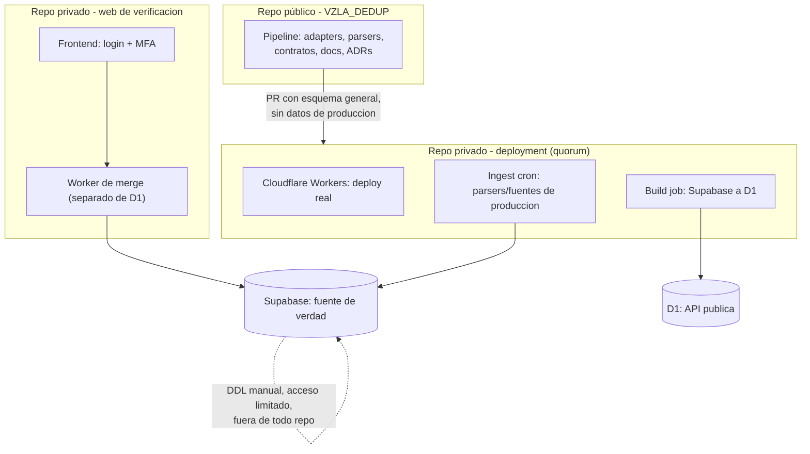
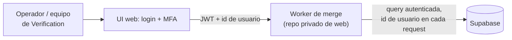

# ADR 0003 — Reestructuración de repos: pipeline público, deployment y web privados

| Campo | Valor |
|---|---|
| Estado | Propuesta |
| Fecha | 2026-07-04 |
| Decisores | Infraestructura, DB/API, Scrapers/Cleaners |
| Reemplaza a | — |
| Complementa | `docs/adr/0001-arquitectura-serving-publico.md`, `docs/adr/0002-endurecimiento-seguridad-cloudflare.md` |
| Relacionado con | `CONTRIBUTING.md`, `docs/base-standards.md §2`, issue #224 |

---

## 1. Contexto

El equipo sacó a Vercel del camino de ingesta. Agregaba overhead, un punto de
fallo adicional y una amenaza de seguridad concreta: aceptaba conexión de
múltiples sistemas y permitía cambios directos de DDL sobre la base de datos.

Según la ADR 0001, el sistema real opera en tres planos: interno (Supabase),
externo (Cloudflare Worker + D1) y puente (GitHub Actions cron). Vercel no
aparece en ninguno de los tres. Eso abre la pregunta que motiva esta ADR: ¿sigue
siendo necesario el repositorio `DataVenezuela/dataVenezuela` tal como existe hoy?

`docs/base-standards.md §2` todavía describe el split vigente: `VZLA_DEDUP`
(pipeline Python, este repo, público) y `dataVenezuela` (Next.js + Supabase,
capa BD/API). Esta ADR reevalúa ese segundo repo.

---

## 2. Fuerzas / análisis

Qué hace `dataVenezuela` hoy:

1. Cambios a la DB y mantenimiento del esquema.
2. Conexión del scraper a Supabase.
3. Página web para manejar merges de humanos manualmente (cuarentena, chequeo
   manual).
4. Build del artefacto público (API pública a D1).

Evaluación de cada punto:

* **(1) es un riesgo activo.** Un repo con acceso DDL a la base de producción,
  donde cambios de schema pueden originarse desde ahí, es exactamente el tipo
  de superficie que se buscaba eliminar al sacar Vercel.
* **(2) está obsoleto.** Ya se saltó Vercel del camino de ingesta; mantener el
  repo por esta razón ya no aplica.
* **(4) es indiferente.** El artefacto público vive en Cloudflare (D1); el
  repo donde vive la configuración de build no cambia ese hecho.
* **(3) es el único punto real a favor.** La página de verificación humana
  cumple una función necesaria, revisar candidatos de duplicado, y además
  tiene arreglo: no requiere que el repo entero sea público ni que exponga el
  resto de la infraestructura.

Como proyecto humanitario, el pipeline (código, contribuciones) debe seguir
siendo público. Eso no implica que el *deployment* también deba serlo, de hecho
es preferible que no lo sea: exponer fuentes, parsers de producción y todo el
sistema de procesamiento le da a cualquiera el mapa para reconstruir la base de
datos por su cuenta, habilitando directamente las amenazas "scraper masivo" y
"verificador de identidades" de la ADR 0002 §2. También multiplica la
superficie de secretos expuestos: GH secrets, URLs internas, logs con datos
sensibles, credenciales de acceso a la BD.

---

## 3. Decisión

Se separa el *deployment* en dos repos privados nuevos, dejando este repo
(`VZLA_DEDUP`) como el único componente público.

### 3.1 Repo público — `VZLA_DEDUP` (sin cambios de rol)

Sigue siendo el pipeline de scraping: adapters, parsers, normalización, PII
masking, contratos, documentación técnica y ADRs. Contribuciones abiertas,
código auditable. Se muestran esquemas generales de fuentes y parsers, no la
configuración específica de producción.

### 3.2 Repo privado de deployment

* Maneja los Workers de Cloudflare (deploy real, con credenciales).
* Se conecta a la base de datos de producción.
* Corre el ingest real (cron).
* Contiene los parsers y fuentes de producción, los que sí tocan datos reales.
* **Quórum obligatorio:** cambios requieren mayoría de votos de contribuidores
  en el PR para aprobarse, no un solo check o aprobador.
* Incluye los scripts de creación de Worker que sean seguros de auditar
  públicamente; el `wrangler deploy` con credenciales reales corre solo desde
  aquí.

### 3.3 Repo privado de página web (verificación humana)

* Frontend con **login + MFA**, conectado a la BD vía public key + JWT token.
* Cada petición de merge lleva el **id del usuario** que la hizo.
* Las peticiones de merge las procesa **otro Worker**, distinto al de D1, con
  sus propias limitaciones (rate-limit, validación).
* Dos conexiones `wrangler` separadas: una para el API público, otra para el
  frontend de verificación.
* Sin razón para dar acceso externo; si hace falta transparencia, se puede
  publicar esquema/estructura general en el repo público.

### 3.4 DDL

El DDL de la base de producción no vive en ningún repo, ni siquiera el privado
de deployment. Se aplica manualmente contra la BD de producción, con acceso
limitado, backups y reforzable con auditoría de Supabase (§7).

---

## 4. Diagrama — arquitectura de repos



Flujo de código: `publico → deploy` (solo esquema general, vía PR con quórum).
Flujo de datos: `ING → SB → BUILD → D1`. El DDL nunca entra por ningún repo.

---

## 5. Diagrama — flujo de verificación humana



Este flujo es distinto del de la API pública (§4): corre en su propio Worker,
exige autenticación humana con MFA y deja trazabilidad de quién hizo cada
merge, coherente con la regla de oro heredada de `docs/README.md`.

---

## 6. Seguridad

Esta decisión refuerza, un nivel más arriba, el mismo modelo de amenazas de la
ADR 0002 §2:

| Amenaza (ADR 0002 §2) | Cómo la mitiga esta ADR |
|---|---|
| Scraper masivo | Los parsers y fuentes de producción dejan de ser públicos. No hay receta para replicar el pipeline completo y reconstruir la base sin sanitizar. |
| Verificador de identidades | Sin acceso a fuentes/parsers reales, no hay forma barata de reproducir el pipeline de lookup fuera del sistema oficial. |
| Fuga de secreto / insider | Los secretos de deployment (credenciales BD, token Cloudflare) viven en un repo privado con quórum, no en un repo público de contribuciones abiertas. |
| Exposición de origen / DDL | El DDL no vive en ningún repo. El acceso a la BD de producción queda limitado y auditable vía logs inmutables de Supabase (§7). |

El borde (Cloudflare) protege el plano público de tráfico externo (ADR 0002).
Esta ADR protege el código y las credenciales que producen ese plano.

---

## 7. Reforzando el DB management

Supabase mantiene logs inmutables. Si el repo privado de deployment tiene una
forma de consultarlos, el equipo puede detectar actividad anómala sin dar
acceso directo al dashboard de producción a todos los contribuidores.

---

## 8. El problema no resuelto (fuera de alcance de esta ADR)

Cómo dar a los scrapers un schema público contra el cual validar su
implementación, sin exponer el schema de producción, queda sin resolver aquí.
La propuesta preliminar (issue #224) es definir un contrato explícito de
precondiciones y postcondiciones, y la interfaz a usar; cuando se necesite algo
nuevo, un scraper deja un PR contra ese contrato. Este contrato es el cuarto
punto del checklist de la issue #224 y merece su propia ADR o documento de
especificación, no se resuelve dentro de esta ADR.

---

## 9. Huecos de transparencia residuales

Ningún control aquí elimina por completo la opacidad. El quórum y el PR
obligatorio la mitigan, no la eliminan:

1. Los admins pueden modificar tablas de producción sin que el repo público lo
   sepa.
2. Fuentes y parsers de producción no se muestran públicamente.
3. Los admins pueden añadir configuración adicional al repo privado sin que el
   público lo sepa.
4. Lo que ocurre dentro de Cloudflare (configuración de Workers, reglas) es un
   blackbox para quien solo ve el repo público.

Mitigación para (3) y (4): quórum y PRs obligatorios en el repo de deployment
(§3.2). Mitigación para (1): logs inmutables de Supabase revisables (§7).

---

## 10. Alternativas consideradas

**A. Mantener `dataVenezuela` tal como está.** Rechazada: conserva el riesgo de
DDL público y el overhead de una integración con Vercel ya innecesaria.

**B. Hacer privado todo el pipeline (`VZLA_DEDUP` incluido).** Rechazada:
contradice la naturaleza humanitaria del proyecto. El pipeline público es lo
que permite auditoría y contribución externa; el riesgo real está en el
deployment y las fuentes de producción, no en el código del pipeline en sí.

**C. Split en repo privado de deployment más repo privado de web (elegida).**
Mantiene el pipeline auditable y abierto a contribuciones, mientras aísla
credenciales, DDL y fuentes/parsers de producción detrás de quórum. Costo: dos
repos privados adicionales que mantener y sincronizar con el público vía PRs de
esquema general.

---

## 11. Consecuencias

**Positivas**

* Cierra el riesgo de DDL público que motivó salir de Vercel.
* Reduce la superficie de reconstrucción masiva de la base (ADR 0002 §2) un
  nivel por debajo del borde de red.
* El pipeline y la documentación técnica siguen públicos y auditables, no se
  pierde la naturaleza humanitaria del proyecto.
* La página de verificación humana gana MFA, atribución de usuario por acción
  y su propio Worker aislado del de D1.
* Los cambios de infraestructura sensible pasan por quórum, no por un solo
  check.

**Negativas / costos asumidos**

* Dos repos privados adicionales que mantener, con su propio ciclo de PRs y
  quórum, más fricción que un solo repo.
* Los contribuidores externos de scrapers ya no pueden ver ni probar contra
  fuentes/parsers reales de producción; dependen del contrato aún sin definir
  (§8).
* `docs/base-standards.md §2` y la sección de `CONTRIBUTING.md` sobre el
  contrato exporter → DB citan `DataVenezuela/dataVenezuela` como fuente de
  verdad actual; quedan desactualizadas en cuanto esta ADR se implemente (ver
  Plan de implementación, último punto).

**Riesgos y mitigaciones**

* *Los repos privados nuevos aún no existen.* Hasta que se creen, esta ADR
  documenta la decisión pero no cambia nada en producción. No renombrar ni
  eliminar referencias a `dataVenezuela` antes de que el reemplazo exista.
* *El contrato DB/scrapers sin resolver (§8)* podría bloquear contribuciones
  externas de scrapers si tarda demasiado. Priorizarlo como siguiente paso
  inmediato tras esta ADR.

---

## 12. Plan de implementación (pendientes)

```text
[ ] Crear el repo privado de deployment (Workers, ingest cron, DB connection,
    parsers/fuentes de produccion)
[ ] Configurar regla de quorum (mayoria de aprobaciones) en el repo de
    deployment
[ ] Crear el repo privado de web de verificacion (login + MFA, Worker de
    merge separado)
[ ] Migrar credenciales/secrets desde cualquier superficie publica hacia los
    repos privados correspondientes
[ ] Confirmar que ningun DDL vive en ningun repo (proceso manual documentado)
[ ] Actualizar docs/base-standards.md §2 para reflejar el nuevo split de repos
[ ] Actualizar CONTRIBUTING.md ("PRs que tocan contrato exporter -> DB") con
    la nueva fuente de verdad
[ ] Escribir el contrato DB/scrapers (precondiciones/postcondiciones,
    interfaz publica), issue #224 punto 4, como trabajo de seguimiento
[ ] Cambiar el historial de commits a usar alias; enforzar alias de GitHub
[ ] Eliminar emails del publico; escribir a los owners de forks existentes
```

**Definición de hecho:** los dos repos privados existen y operan (deployment
con quórum activo, web con MFA); ningún secreto ni parser/fuente de producción
vive en el repo público; el DDL no vive en ningún repo; las referencias a
`dataVenezuela` en `base-standards.md` y `CONTRIBUTING.md` están actualizadas.

---

## Regla de oro (heredada de `docs/README.md`)

```text
Duplicar es tolerable.
Perder trazabilidad no.
Exponer PII no.
El plano público no posee datos en claro.
```
