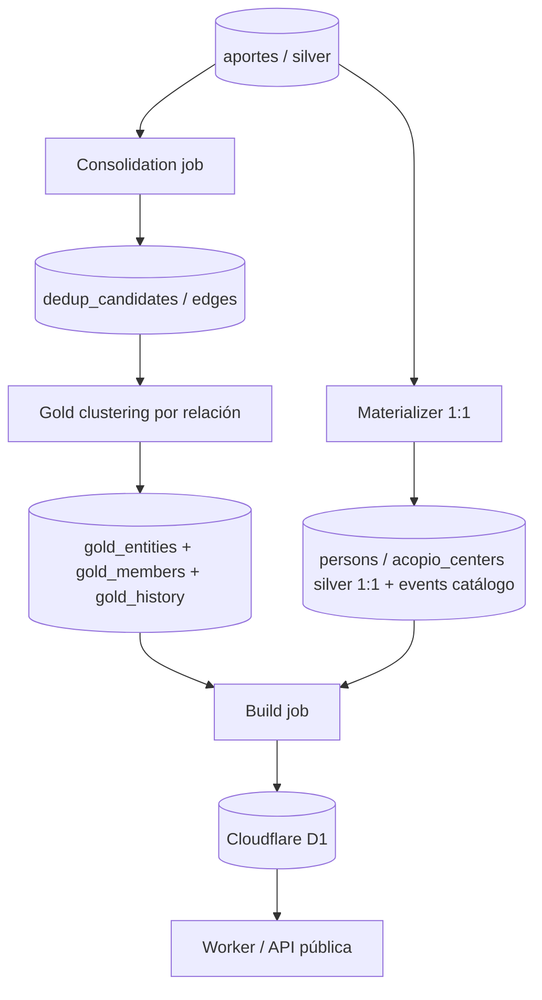

# ADR 0007 — Modelo de consolidación y capa gold

| Campo | Valor |
|---|---|
| Estado | Aceptada |
| Fecha | 2026-07-06 |
| Decisores | DB/API, Scrapers/Cleaners, Verification |
| Reemplaza a | [ADR 0001](./0001-arquitectura-serving-publico.md) §5 (modelo de datos del artefacto público) |
| Complementa | [ADR 0006](./0006-proteccion-pii-ingesta.md) (protección de PII) |
| Relacionado con | `docs/pipeline.md`, `docs/schema.md`, `docs/specs/person-dedup.md`, `docs/specs/db-scraper-contract.md` |

---

## 1. Contexto

Los registros llegan a `aportes` (silver/staging) desde muchas fuentes
inconsistentes. La misma persona aparece varias veces con nombres, cédulas y
ubicaciones distintas. Falta registrar como decisión de arquitectura como se pasa
de `aportes` a la capa que consume el plano público, sin fusionar mal ni exponer
PII.

ADR 0001 §5 proyectaba el artefacto público **directo desde `persons` (silver)**.
Eso es insuficiente y peligroso: las tablas tipadas de silver son una proyección
1:1 de `aportes` (un aporte, una fila), así que publicar desde silver muestra cada
duplicado como una
entidad distinta, y no hay lugar canónico para la fusión ni para el estado de
verificación. Fuerza dominante del proyecto (`docs/pipeline.md`, "Regla crítica de
deduplicación"): **duplicar es tolerable, fusionar mal puede ser peligroso**.

---

## 2. Decisión

Se adopta un pipeline medallón con una capa **gold** como única sede de la fusión.
A partir de `aportes` corren tres procesos independientes que nunca modifican ni
borran el aporte original (la trazabilidad hacia el aporte de origen se conserva siempre):

1. **Materializer:** proyecta cada aporte a su tabla tipada 1:1 según
   `entity_type`: `person` a `persons`, `acopio` a `acopio_centers`, ambas con PK
   compartida y FK a `aportes.id`. `events` es un **catálogo compartido** (PK
   propia, sin FK 1:1 por aporte), que el materializer resuelve o asegura antes de
   proyectar los registros que lo referencian. Silver **nunca colapsa**.
2. **Consolidation job:** compara aportes por block keys y emite **aristas
   puntuadas** en `dedup_candidates` (`left_aporte_id`/`right_aporte_id`,
   `blocking_key`, `score`, `reasons`, `priority` entero, `touches_gold`,
   `decision`), en vez de fusionar en el sitio. No toma decisiones de fusión.
3. **Gold clustering:** agrupa aportes **por relación, no por tiempo** (componentes
   conexos sobre el grafo de aristas) y materializa clusters en `gold_entities` +
   `gold_members` + `gold_history`.

El **build job** publica **solo gold** (`gold_entities` publicado + aportes
huérfanos, uniendo datos tipados desde silver) a Cloudflare D1, para que cada
entidad aparezca exactamente una vez.

---

## 3. Modelo / contrato

- **Compuerta de publicación = fuerza de la arista.** Los clusters unidos por
  aristas fuertes (`ced:…`, identidad determinista) se fusionan y publican
  automáticamente. Las aristas difusas (`phon:…`, solo fonética o nombre) **no**
  fusionan: quedan `pending` en `dedup_candidates` (cola de revisión humana) y sus
  aportes se publican **sin fusionar** hasta que un humano acepta el candidato.
- **`verification_status` vive en `gold_entities`**, no en `persons`, y es
  ortogonal a la confianza de merge (`score` / `confidence_score` /
  `dedup_candidates.decision`). Una entidad bien fusionada puede seguir
  `unverified`, y una `verified` no dice nada sobre como se fusionó.
- **Estabilidad de `gold_id`:** se acuña una vez (`gen_random_uuid`) y se reutiliza
  mientras el cluster recomputado solape cualquier `gold_members` actual. No se
  deriva de un hash del conjunto de miembros (rompería `superseded_by`,
  `gold_history` y `gold_members.via_candidate`).
- **Huérfanos:** un aporte sin arista fuerte no recibe fila en gold; el build une
  gold publicado + huérfanos.

---

## 4. Seguridad

- Silver nunca colapsa y bronze es inmutable: ninguna fusión destruye evidencia ni
  trazabilidad.
- La protección de menores (ADR 0006) se aplica por aporte antes de staging; el
  build a D1 debe respetarla al fusionar el cluster (no reintroducir foto, cédula
  parcial ni ubicación exacta desde otro miembro del mismo cluster).
- El plano público no asume que una entidad está verificada solo por estar
  publicada.

---

## 5. Consecuencias

**Positivas**

- Un lugar canónico y auditable para la fusión; el plano público muestra cada
  entidad una vez.
- Fusionar mal se acota: solo señales fuertes fusionan solas; lo difuso pasa por
  humano.

**Negativas / costos asumidos**

- Más piezas (materializer, clustering, build) y más tablas que mantener.
- Bajo condiciones difusas, la vista pública puede mostrar duplicados hasta que un
  humano los acepte (costo tolerable).

**Riesgos y mitigaciones**

- *Under-merge entre lotes*: la generación de aristas debe bloquear contra **todos**
  los aportes que comparten block key, no solo dentro del lote (ver
  `docs/pipeline.md` §5.2).
- *Churn de identidad de cluster*: mitigado por la regla de estabilidad de
  `gold_id`.

---

## 6. Alternativas consideradas

- **Proyectar el artefacto público desde silver (ADR 0001 §5).** Rechazada:
  publica cada duplicado como entidad distinta y no tiene sede para la fusión ni
  para `verification_status`.
- **Colapsar duplicados en silver.** Rechazada: destruye trazabilidad y arriesga
  falsos merges irreversibles.

---

## 7. Plan de implementación

- Escribir el materializer (writer de silver 1:1) y el clustering de gold (hoy
  diseñados, sin writer; ver "Estado de implementación" en `docs/pipeline.md`).
- Migrar el `consolidation_job.py` a la forma viva de `dedup_candidates`
  (`*_aporte_id`, `priority` entero, `touches_gold`) y cablearlo al cron.
- Cerrar los huecos código-vs-canon registrados (columnas que el exporter emite
  fuera del `aportes` canónico, `aportes.consolidated_at`, nullability de
  `artifact_id`) contra `docs/schema.md`, como parte de la migración de `aportes`.
- Restricciones must-link / cannot-link y re-clustering periódico: Fase 2.

---

## 8. Regla de oro

Silver nunca colapsa. La fusión vive solo en gold. Solo las señales fuertes
fusionan solas; duplicar es tolerable, fusionar mal puede ser peligroso.
