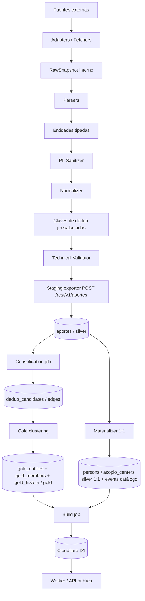

# VZLA_DEDUP — Pipeline técnico

Este documento describe el flujo técnico del pipeline de VZLA_DEDUP.

El objetivo es recolectar registros dispersos, convertirlos en entidades tipadas, proteger datos sensibles, normalizarlos y enviarlos a staging (`aportes`) en Supabase. A partir de ahí un pipeline medallón los proyecta a tablas tipadas 1:1 (silver), los enlaza con aristas de candidatos puntuados (`dedup_candidates`) y los agrupa en entidades canónicas fusionadas (`gold_entities`) que consume la API pública. Silver nunca colapsa registros: la fusión vive solo en gold.

---

## Flujo completo

```
Fuentes externas
      ↓
Adapters (fetch raw)
      ↓
Parsers (raw → entidad tipada)
      ↓
PII masking (HMAC antes que nada)
      ↓
Normalización (texto, fechas, ubicaciones)
      ↓
Claves de dedup pre-calculadas (dedup_hash, block_keys)
      ↓
┌─────────────────────────────┐     ┌──────────────────────┐
│  Raw DB (R2 + Supabase)     │     │  Quarantine DB        │
│  Payload enmascarado,       │ ←── │  Sin parser, PII      │
│  inmutable, trazable        │     │  no redactable, etc.  │
└─────────────────────────────┘     └──────────────────────┘
      ↓
Staging exporter → POST /rest/v1/aportes → aportes (Supabase)   [silver / staging]
      ├─ materializer → persons / acopio_centers (silver 1:1, PK = aportes.id) + events (catálogo)
      │
      ↓  consolidation job (cada 20 min): similaridad sobre aportes → aristas
dedup_candidates (edges: ced:… fuertes / phon:… difusas)
      ↓  gold clustering (agrupa por relación, no por tiempo)
gold_entities + gold_members + gold_history (gold, fusión canónica)
      ↓  build job: gold publicado + aportes huérfanos (con datos tipados de silver)
Cloudflare D1 → Worker → API pública
```

---

## Capa 1 — Adapters

Cada tipo de fuente tiene un adapter dedicado. El adapter solo hace fetch: devuelve un `RawContent` con el payload crudo y metadatos del request (status HTTP, timestamp, hash del contenido). No interpreta ni transforma nada.

| Tipo | Módulo | Estado |
|------|--------|--------|
| `api_json` | `scrapers/adapters/api_adapter.py` | ✅ Implementado (httpx, paginación, retry) |
| `html_static` | `scrapers/adapters/html_adapter.py` | ✅ Implementado (requests + BeautifulSoup) |
| `rss` | `scrapers/adapters/rss_adapter.py` | ✅ Implementado (un registro por `<item>` del feed) |
| `manual_file` / `text` | `scrapers/adapters/local_file.py` | ✅ Implementado (lectura local) |
| `pdf` | `scrapers/adapters/pdf_adapter.py` | ✅ Implementado (pdfplumber) |
| `webapp_js` | `scrapers/adapters/playwright_adapter.py` | ✅ Implementado (Playwright headless, timeout/retries configurables) |

Helpers de implementación compartidos entre adapters (timestamp UTC, hash de
contenido para `content_hash`, backoff exponencial con jitter) viven en
`scrapers/adapters/_shared.py` — ningún adapter debería reimplementarlos.

### Parsers implementados

| Parser | Módulo | Estado |
|--------|--------|--------|
| `encuentralos` | `scrapers/parsers/encuentralos_parser.py` | ✅ Implementado |
| `demo_text` | `scrapers/parsers/demo_text_parser.py` | ✅ Implementado solo para el fixture sintético local |

Si una fuente no tiene parser concreto asignado, `_get_parser` loguea un
warning y la fuente se omite (devuelve `None`). No hay parser de fallback
genérico: el `_TextFallbackParser` fue eliminado en #81.

### Ejecución

```bash
# Pipeline completo con fuentes del config
python -m scrapers.cli run --config scrapers/config/sources.yaml --output scrapers/runtime_output

# Limitar a N registros por fuente
python -m scrapers.cli run --config scrapers/config/sources.yaml --output scrapers/runtime_output --limit 50
```

### Diseño de resiliencia

- Un error en un registro individual no tumba el pipeline.
- Un error en una fuente entera se loguea y se continúa con la siguiente.
- `adapter.close()` corre en `finally` dentro de `_run_source()`: si el fetch
  de una fuente falla (ej. Playwright agota sus reintentos), el adapter
  libera sus recursos (browser, conexiones) igual, sin importar si la fuente
  finalmente cuenta como error o no.
- `PII_SALT` es opcional en CI: sin salt, los campos PII crudos se eliminan antes de exportar.
- La deduplicación de Person se excluye intencionalmente del orquestador (requiere revisión humana).

### Tests

Tests de integración offline en `scrapers/tests/test_run_pipeline.py`. Ninguno
hace red real: el destino staging (`/rest/v1/aportes`) se intercepta con
`httpx.BaseTransport` inyectado en el `StagingExporter`.

---

## Principios del pipeline

El pipeline sigue estos principios:

1. Cada capa tiene una responsabilidad clara.
2. La recolección no debe conocer reglas de negocio.
3. Los parsers no deben persistir PII en claro.
4. La limpieza debe operar sobre entidades tipadas.
5. La deduplicación de personas no debe ser destructiva.
6. Todo output debe mantener trazabilidad hacia la fuente.
7. Los registros incompletos no deben descartarse automáticamente.
8. Los errores de un registro no deben tumbar todo el pipeline.
9. Los campos desconocidos deben exportarse como `null`.
10. Nada de datos reales debe aparecer en tests, fixtures o documentación.

---

## Diagrama general



---

## Capas del pipeline

## 1. Fuentes externas

Las fuentes externas son los lugares desde donde se obtiene información.

Ejemplos:

* Webs públicas.
* WebApps con JavaScript.
* APIs públicas.
* PDFs públicos.
* Archivos manuales autorizados.
* Planillas públicas.
* Publicaciones verificables.
* Fuentes oficiales.
* Fuentes de organizaciones humanitarias.

No todas las fuentes deben tener el mismo nivel de confianza.

Cada fuente debe estar declarada en una configuración explícita antes de ser scrapeada.

---

## 2. Source Config

Antes de crear un scraper, la fuente debe registrarse en un archivo de configuración.

Ejemplo:

```yaml
id: hospital_central_demo
name: Hospital Central Demo
type: html_static
entity_type: person
url: https://example.org/demo
parser_asignado: hospital_central_person_parser
trust_tier: C
enabled: true
rate_limit_per_minute: 10
allowed_domains:
  - example.org
notes: Fuente demo sin datos reales.
```

La configuración debe indicar:

* Qué fuente se va a consultar.
* Qué tipo de fuente es.
* Qué parser debe procesarla.
* Qué entidad produce.
* Qué nivel de confianza tiene.
* Qué dominios están permitidos.
* Qué límites de consulta deben respetarse.

La configuración detallada vive en `docs/source_config.md`.

---

## 3. Adapters / Fetchers

Los adapters son responsables únicamente de obtener contenido raw desde una fuente.

Un adapter no debe interpretar el significado del contenido.

### Tipos de adapters

```text
webapp_js    → Playwright
html_static  → BeautifulSoup / httpx
api_json     → httpx
pdf_manual   → pdfplumber
local_file   → lectura local controlada
```

### Responsabilidad del adapter

El adapter debe:

* Hacer fetch de la fuente.
* Respetar rate limits.
* Validar dominio permitido.
* Capturar status HTTP.
* Capturar content type.
* Calcular hash del contenido.
* Devolver raw content al parser.
* Registrar errores técnicos sin PII.

El adapter no debe:

* Normalizar nombres.
* Hashear cédulas.
* Deduplicar personas.
* Decidir estados de negocio.
* Hacer merges.
* Persistir datos sensibles.
* Loguear contenido raw con PII.

---

## Salida interna del adapter

La salida del adapter es un objeto interno llamado `RawSnapshot`.

Ejemplo:

```json
{
  "source_key": "hospital_central_demo",
  "source_url": "https://example.org/demo",
  "fetched_at": "2026-06-24T15:30:00Z",
  "http_status": 200,
  "content_type": "text/html",
  "content_hash": "sha256:examplehash",
  "raw_content": "<html>...</html>"
}
```

`raw_content` puede contener PII.

Por eso:

* Es solo de uso interno.
* No debe exportarse a JSONL.
* No debe commitearse.
* No debe imprimirse completo en logs.
* No debe persistirse sin una política explícita de seguridad.

---

## 4. Parsers

Los parsers convierten el contenido raw de una fuente en entidades tipadas.

Cada fuente debe tener su propio parser, porque cada fuente puede tener estructuras, nombres de campos y formatos distintos.

Ejemplos:

```text
encuentralos_parser      → Person
veneconnect_parser       → AcopioCenter
usgs_parser              → Event
hospital_central_parser  → Person
```

---

## Responsabilidad del parser

El parser debe:

* Recibir un `RawSnapshot`.
* Extraer registros individuales.
* Mapear campos de la fuente al modelo interno.
* Convertir estados externos a enums internos.
* Extraer fechas, ubicaciones, nombres y notas.
* Enviar datos sensibles al sanitizer antes del export.
* Asociar cada registro con su fuente.
* Producir entidades tipadas.

El parser no debe:

* Guardar PII en claro.
* Loguear cédulas, teléfonos o direcciones exactas.
* Hacer deduplicación global.
* Confirmar que dos personas son la misma.
* Descartar registros por estar incompletos.
* Inventar campos que la fuente no tiene.

---

## NLP y texto libre

Cuando una fuente contiene texto libre, como PDFs narrativos o HTML sin estructura clara, el parser puede usar extracción de entidades.

Ejemplos:

* Nombres de personas.
* Hospitales.
* Estados.
* Municipios.
* Fechas.
* Condición reportada.
* Centros de acopio.
* Necesidades urgentes.

Este paso pertenece al parser o a un extractor usado por el parser.

La limpieza posterior no debería trabajar sobre texto crudo, sino sobre entidades ya tipadas.

---

## Salida interna del parser

El parser debe producir entidades tipadas.

Ejemplo conceptual:

```json
{
  "entity_type": "person",
  "source_key": "hospital_central_demo",
  "source_url": "https://example.org/demo",
  "raw_external_id": "row-15",
  "full_name_raw": "José Luis Pérez",
  "cedula_raw": "V-12345678",
  "phone_raw": null,
  "age_raw": "aprox. 35",
  "status_raw": "No localizado",
  "location_raw": "El Tocuyo, Lara",
  "source_date_raw": "24/06/2026 14:30"
}
```

Este objeto es interno.

Antes de exportar, debe pasar por sanitización PII y normalización.

---

## 5. Entidades tipadas

Después del parser, el sistema debe trabajar con entidades tipadas.

Entidades principales (los tres tipos que produce el parser, más el evento que
las contextualiza):

```text
Person       → aportes / persons
AcopioCenter → aportes / acopio_centers
Event        → events (catálogo compartido de eventos)
```

Cada registro parseado se persiste como un `aporte` (silver) y se proyecta 1:1 a
su tabla tipada de silver (`persons` / `acopio_centers`). La corroboración entre
fuentes **no** es una entidad tipada aparte: emerge del grafo de aristas
(`dedup_candidates`) y de la pertenencia a un cluster de gold (`gold_members`),
no de un modelo `PersonSource`. De la misma forma, notas y fotos viajan dentro
del `raw_json` del aporte, no como tablas `PersonNote` / `PersonPhoto`
independientes.

La idea es que el resto del pipeline no dependa de la estructura original de la fuente.

Una vez que existe una entidad tipada, los módulos de limpieza, normalización, deduplicación y export pueden ser reutilizados para muchas fuentes.

---

## 6. PII Sanitizer

La sanitización de PII debe ocurrir lo antes posible después del parsing.

PII significa información que puede identificar, ubicar o contactar directamente a una persona.

Ejemplos:

* Cédula.
* Teléfono.
* Dirección exacta.
* Nombre de contacto familiar.
* Fotos.
* Información de menores.
* Datos médicos sensibles.
* Ubicación exacta de una persona vulnerable.

---

## Responsabilidad del PII Sanitizer

El sanitizer debe:

* Hashear cédulas usando HMAC SHA-256.
* Hashear teléfonos si el proyecto decide almacenarlos.
* Generar versiones masked cuando aplique.
* Eliminar valores crudos antes del export.
* Evitar que PII llegue a logs.
* Evitar que PII llegue a errores serializados.
* Marcar datos sensibles para revisión si aplica.

Ejemplo:

```json
{
  "cedula_hmac": "sha256-hmac-hex",
  "cedula_masked": "V-****5821"
}
```

No se debe exportar:

```json
{
  "cedula": "V-12345678"
}
```

---

## Regla crítica sobre PII

El parser puede tocar PII en memoria para transformarla, pero la PII cruda no debe persistirse ni aparecer en logs, fixtures, outputs o commits.

---

## Política de normalización de `cedula_hmac`

`cedula_hmac` se calcula sobre el valor normalizado de la cédula
(`shared.hashing.identity_token` / `hmac_hex`, usados también por
`scrapers.sanitizers.pii_tokenizer.mask_cedula`). Esa normalización:

* Quita puntuación, espacios y acentos.
* **Conserva** la letra de nacionalidad (V/E) si la fuente la trae.

Decisión explícita: la letra de nacionalidad SÍ forma parte del
identificador canónico. `"V12345678"` y `"12345678"` (mismos dígitos, sin
prefijo) producen `cedula_hmac` **distintos**.

Por qué: los rangos de cédula V (venezolano) y E (extranjero) se asignan de
forma independiente, así que los mismos 8 dígitos pueden pertenecer a dos
personas reales distintas según el prefijo. Ignorar el prefijo arriesga un
falso merge entre esas dos personas, que es justo el daño que busca evitar
la "Regla crítica de deduplicación" (ver sección 8): *fusionar mal puede
ser peligroso*, *duplicar es tolerable*.

Costo aceptado: si una fuente reporta la cédula sin el prefijo de
nacionalidad (error de captura o formato), ese registro no va a coincidir
por `cedula_hmac` con el mismo dato sí-prefijado. Mitigación: `cedula_hmac`
es una señal de blocking/similarity, no la única — el scoring de Personas
(ver "Similarity scoring") debe poder generar candidatos por nombre, edad y
ubicación aunque `cedula_hmac` no coincida; la revisión humana decide el
merge final.

Si en el futuro se decide ignorar el prefijo de nacionalidad, ese cambio
debe documentarse explícitamente aquí y migrar/recalcular los
`cedula_hmac` ya exportados — no son compatibles entre políticas distintas.

---

## Protección de menores (`is_minor`)

`Person.is_minor` es `bool | None`: `true` si la persona reportada es menor
de 18 años, `false` si se sabe que es mayor, `None` si no se puede
determinar (no hay edad reportada).

Solo el valor explícito `true` activa protección — `None`/`false` no
disparan ninguna reducción, porque ausencia de edad no implica minoría de
edad.

Cuando `is_minor=true`, antes de enviar el aporte a staging
(`scrapers.sanitizers.minor_protection.protect_minor_fields`, ejecutado como
etapa propia del pipeline justo antes del staging exporter):

* `foto` se anula (`null`) — una foto es directamente identificable.
* `cedula_masked` se anula (`null`) — deja de mostrarse la cédula parcial en
  claro. `cedula_hmac` **no** se toca: sigue siendo un hash, no identifica
  por sí solo, y Stage 1 lo necesita para matching.
* `last_known_location` se acota a nivel estado (`"Municipio, Estado"` →
  `"Estado"`) para no facilitar la localización exacta de un menor.

`EncuentralosParser` deriva `is_minor` automáticamente cuando la fuente
reporta `edad` (`edad < 18` → `true`); si la fuente no reporta edad,
`is_minor` queda en `None`. Cualquier parser futuro que reciba una edad
puntual o un `age_range` debe derivar `is_minor` de la misma forma.

Pendiente: cuando varios aportes corroboran a la misma persona y quedan en un
mismo cluster de gold (`gold_members`), la proyección pública no debe exponer más
detalle del que expone el aporte protegido con `is_minor=true`. La protección se
aplica por aporte antes de staging; el build a D1 debe respetarla al fusionar el
cluster (no reintroducir foto, cédula parcial ni ubicación exacta desde otro
miembro del mismo cluster).

---

## 7. Normalizer

El normalizer convierte datos heterogéneos en formatos estables.

Debe trabajar sobre entidades ya tipadas y sanitizadas.

---

## Responsabilidad del normalizer

El normalizer debe normalizar:

* Nombres.
* Fechas.
* Ubicaciones.
* Enums.
* Rango de edad.
* Estados de persona.
* Estados de acopio.
* Necesidades.
* Strings vacíos.
* Booleanos.

---

## Reglas globales de normalización

```text
Fechas      → UTC ISO 8601
IDs         → UUID v4
Nulls       → null explícito
Booleanos   → true / false
Enums       → strings controlados
Scores      → número entre 0.000 y 1.000
```

No usar:

```text
""
"N/A"
"null"
"None"
"desconocido" como sustituto de null
0 como sustituto de valor desconocido
"Si" / "No" para booleanos
```

---

## Normalización de nombres

Reglas recomendadas:

* Trim de espacios.
* Colapsar espacios múltiples.
* Convertir a mayúsculas.
* Normalizar unicode.
* Remover caracteres invisibles.
* Mantener nombre original solo si existe política para eso.
* Guardar variantes en `alternate_names`.

Ejemplo:

```text
"  José   Luis Pérez  "
```

Debe normalizarse como:

```text
"JOSE LUIS PEREZ"
```

---

## Normalización de fechas

Helpers compartidos entre adapters (timestamp UTC, hash de contenido, backoff exponencial) viven en `scrapers/adapters/_shared.py`.

---

## Capa 2 — Parsers

Cada fuente tiene un parser específico que implementa `ParserProtocol`. El parser recibe el `RawContent` del adapter y devuelve `list[Person | AcopioCenter | Event]`.

El parser conoce la estructura de su fuente: qué campo es el nombre, qué campo es la cédula, qué valor de status mapea a qué enum.

**Agregar una fuente nueva = escribir un parser nuevo.** El resto del pipeline no cambia.

| Parser | Módulo | Entidad | Estado |
|--------|--------|---------|--------|
| `encuentralos` | `scrapers/parsers/encuentralos_parser.py` | `Person` | ✅ |

Si una fuente no tiene parser asignado, sus registros van a **cuarentena** — no al basura, no a un fallback genérico. El FallbackParser fue eliminado.

---

## Capa 3 — Limpieza (orden fijo e inamovible)

### 3.1 PII — va primero

Cédulas y teléfonos se HMAC antes de cualquier otro procesamiento. El campo original no se guarda en ningún lugar.

- `cedula_hmac` = `shared/hashing.identity_token(cedula, secret)` → hex puro 64 chars, sin prefijo
- `cedula_masked` = últimos 4 dígitos con máscara (`V-****5821`)
- `telefono_contacto` de terceros se descarta explícitamente (familiar que reportó)

El secreto viene de `PII_HMAC_SECRET` (env var). Sin él, el pipeline no produce HMAC — los campos quedan `None`. En CI offline esto está aceptado; en producción es obligatorio.

### 3.2 Normalización — va antes de dedup

El matching necesita texto uniforme. `"JOSE LUIS"` y `"José Luis"` deben ser el mismo registro antes de comparar.

- **Texto:** unicode, tildes, mayúsculas, espacios, abreviaciones venezolanas (`ve_abbreviations.json`)
- **Fechas:** todo a ISO 8601 UTC (`normalize_date`)
- **Ubicaciones:** nombre normalizado + coordenadas opcionales via OpenStreetMap (`normalize_location`). Si la API falla, `lat/lng = null`; el registro no se descarta
- **NLP:** para fuentes de texto libre (PDFs, HTML narrativo), `spaCy es_core_news_sm` extrae entidades antes del mapeo

### 3.3 Claves de dedup — se calculan aquí, antes de enviar a staging

- `dedup_hash` — SHA-256 del contenido normalizado. Para Event y AcopioCenter, dos registros con el mismo hash son duplicados exactos.
- `block_keys` — para Person: fonética del nombre (Double Metaphone / NYSIIS) + primeras letras + estado. Permite agrupar candidatos sin comparar todos contra todos.

---

## Capa 4 — Staging exporter (Issue #81) y watermark por fuente (Issue #57)

`scrapers/exporters/staging_exporter.py` lee las entidades procesadas (un dict
por registro, post-PII, post-score, post-protección de menores) y hace un
upsert directo a Supabase via PostgREST.

Responsabilidades del exporter:
- Construir el payload del aporte usando los contratos de
  `scrapers/dedup/specs.py`: `entity_type`, `external_id`, `dedup_hash`,
  `dedup_version`, `block_keys`, `content_hash`, `source_id` y `raw_json`
  (el record de negocio sin claves internas con prefijo `_`). Keys en
  snake_case. El exporter resuelve `source_id` (uuid) a partir del slug de la
  fuente: `source_slug` no viaja al POST. Además emite algunas claves no
  canónicas (`run_id`, `scraper_id`, `source_url`, `parser_version`) que hoy
  no son columnas de `aportes`; ver `docs/specs/db-scraper-contract.md` §4.2.
- `external_id` es determinista (fingerprint v1 para Event/AcopioCenter,
  `deterministic_id` para Person). PostgREST hace upsert por `external_id`
  via `Prefer: resolution=merge-duplicates`, así que re-correr la misma
  fuente no duplica (idempotencia).
- Enviar en lotes (batch) configurables por fuente (`bulk_size` /
  `max_concurrent_posts` de `SourceConfig`). Cada batch exitoso (2xx) cuenta
  como enviado; un batch fallido se registra en `result.errors`.
- Avanzar el watermark de la fuente (`POST /rest/v1/source_watermarks` con
  `Prefer: resolution=merge-duplicates`, body `{"slug": "...", "watermark_at": "<ISO>"}`)
  a `max(fetched_at)` menos un margen de seguridad (`_WATERMARK_SAFETY_MARGIN`,
  ver más abajo). El watermark avanza si no hubo errores previos al export
  (parseo, PII, enriquecimiento, protección de menores) y se envió al menos un
  registro (`sent > 0`): puede avanzar aunque algún `POST` a `aportes` haya
  fallado. El margen de seguridad de 5 minutos más la idempotencia por
  `external_id` sostienen la entrega at-least-once (el ciclo siguiente reenvía
  los registros de la ventana de overlap sin duplicar). Un watermark avanzado
  no implica cero pérdida en ese ciclo. Ver
  `docs/specs/db-scraper-contract.md` §7.

Auth con Supabase: header `apikey` con la publishable key del proyecto
(`SUPABASE_PUBLISHABLE_KEY`) + `Authorization: Bearer` con un JWT firmado
con el rol `scraper_ingest` (`SUPABASE_INGEST_JWT`). El JWT se genera una
sola vez offline contra `SUPABASE_JWT_SECRET` del proyecto y PostgREST lo
valida localmente, sin requests extra de auth.

### Fuente de verdad del contrato exporter -> DB

El schema de staging, watermarks, cuarentena y jobs que escriben directo a
Supabase tiene su fuente de verdad en `docs/schema.md` (mirror completo y
autoritativo) más las specs de contrato en `docs/specs/`
(`db-scraper-contract.md`, `person-dedup.md`).

No agregues una copia local ad hoc del schema real (por ejemplo
`tools/sql/issue_*.sql`) para que los tests pasen contra esa copia. Los fixtures
de contrato deben derivar de `docs/schema.md`. Esto evita que exporters y jobs
pasen CI contra columnas o payloads que no existen en la BD real.

### Semántica del watermark: `fetched_at` (wall-clock local) vs `updated_at` (servidor)

El watermark persiste `max(fetched_at)`, donde `fetched_at` es el momento en
que **este scraper** terminó de descargar la página (wall-clock local del
adapter, `now_utc()`) — **no** el `updated_at` del registro en el servidor de
la fuente. Mientras el watermark era solo informativo (antes de #57) esto no
importaba; ahora que filtra el fetch real (`updated_after`) es **load-bearing**:

Si un registro se actualiza en el servidor **mientras el fetch está en
vuelo** (entre que el servidor ejecutó la query y que terminamos de recibir
la respuesta), la respuesta que ya recibimos no lo refleja, pero el
`fetched_at` que persistimos como watermark es *posterior* a esa
actualización. La siguiente corrida pediría `updated_after=<ese watermark>`
y el servidor excluiría ese registro — quedaría perdido permanentemente, sin
que la idempotencia por `external_id` lo remedie (nunca lo volveríamos a
pedir).

Mitigación: `_apply_safety_margin` resta `_WATERMARK_SAFETY_MARGIN` (5
minutos) al watermark antes de persistirlo, creando una ventana de overlap
en cada corrida. La idempotencia por `external_id` en la BD absorbe
los registros re-enviados en ese overlap sin duplicar. El margen es una
mitigación, no una garantía formal — depende de que el reloj del scraper y el
del servidor de la fuente no diverjan más que el margen, y de que la latencia
de un fetch individual no exceda esa ventana. **Pendiente de confirmar con
cada fuente:** si su API interpreta `updated_after` de forma inclusiva o
exclusiva en el límite exacto.

`source_slug` **no** vive en `StagingConfig`: una corrida del pipeline procesa
múltiples fuentes (`run_pipeline._run_source` itera todas las habilitadas), así
que `source_slug` es siempre `source.id` y se pasa explícito en cada llamada a
`StagingExporter.get_watermark(source_slug)` / `export_source(..., source_slug=...)`.
Esto mantiene watermarks independientes por fuente dentro de la misma corrida.
Como `source.id` viaja como valor `slug` hacia `/rest/v1/source_watermarks` (en
el body del upsert y como filtro en las lecturas PostgREST),
`validate_sources_config` exige que sea único entre fuentes y que solo contenga
`[a-zA-Z0-9_-]`.

Antes de hacer el fetch, `_run_source` lee `exporter.get_watermark(source.id)`
**dentro** del mismo `try/finally` que cierra el adapter, y lo pasa como
`params={"updated_after": ...}` a `adapter.fetch_all(...)`. El `ApiAdapter` lo
reenvía como query param real; el resto de adapters (RSS, PDF, HTML,
Playwright, archivo local) lo ignora (no soportan filtrado server-side). Si la
fuente nunca tuvo watermark, `get_watermark` devuelve el default
`1970-01-01T00:00:00Z`, lo que provoca backfill completo en la primera corrida.
Una lectura fallida del watermark (red, 5xx, o un body 2xx con JSON
malformado/no-dict) tampoco bloquea el fetch ni filtra el cierre del adapter:
degrada al mismo default en vez de abortar la fuente.

Modo dry-run silencioso: si faltan las env vars `SUPABASE_*` (`SUPABASE_URL`,
`SUPABASE_PUBLISHABLE_KEY`, `SUPABASE_INGEST_JWT`), el exporter queda
deshabilitado, no abre cliente HTTP (cero red), loguea a INFO lo que enviaría y
termina con `staging_sent=0` sin error.

El exporter no toma decisiones de dedup. Su única responsabilidad es persistir
en staging; el dedup vive en el consolidation job (#82).

---

## Capa 4b — Quarantine exporter (Issue #88)

**Principio inamovible:** ningún registro se descarta en silencio. En una crisis
donde cada registro puede ser una vida, descartar automáticamente no es
aceptable. Todo lo que el pipeline antes perdía va a la **Quarantine DB** para
revisión humana.

`scrapers/exporters/quarantine_exporter.py` (`QuarantineExporter`) espeja al
`StagingExporter`: un `POST /api/v1/quarantine` por registro, cliente
`httpx` inyectable, retry/backoff en 429/5xx, y **dry-run silencioso** si faltan
`QUARANTINE_API_KEY` / `QUARANTINE_BASE_URL`. Comparte el `run_id` de la corrida
con el staging exporter para correlacionar qué se exportó y qué se cuarentenó.

> **BUG (pendiente):** ese `POST /api/v1/quarantine` apuntaba al backend HTTP que
> ya no existe, así que el envío a cuarentena está roto. La ruta hay que
> actualizarla: la cuarentena debe escribir directo a Supabase (como `aportes`,
> vía PostgREST) contra la tabla `quarantined_records`.

La tabla `quarantined_records` es la de `docs/schema.md`; el scraper no ejecuta SQL.

### Qué va a cuarentena y desde dónde

`run_pipeline.py` enruta a cuarentena en cada punto donde antes se perdía el dato:

| Punto en el pipeline | `reason_code` | `risk_level` |
|----------------------|---------------|--------------|
| Fuente sin parser asignado (se baja el crudo igual) | `parser_unavailable` | `medium` |
| Página que falla al parsear | `invalid_schema` | `medium` |
| PII no tratable/redactable (ni rescatable sin PII) | `pii_untreatable` | `high` |
| Protección de menores falla (fail-closed solo para staging) | `pii_untreatable` | `high` |

Otros `reason_code` controlados (los produce el backend o etapas futuras):
`pdf_no_text`, `unclassified_sensitive`, `contradictory_sources`,
`ambiguous_manual_review`.

Un **type sin adapter** implementado omite la fuente entera: no hay payload que
cuarentenar (nunca se hizo fetch), pero la omisión queda **visible** en
`summary["errors"]` — nunca silenciosa.

### Reglas de PII en cuarentena

- `payload_preview_redacted`: fragmento **redactado** con `redact_pii`, nunca el
  payload completo (se trunca a 500 chars). Sin PII en claro.
- `pii_findings_summary`: **conteos por tipo** de `detect_pii`
  (`{"identity_document": 2, "phone": 1}`), nunca los valores.
- `payload_hash`: SHA-256 hex puro (64 chars, sin prefijo `sha256:`) del payload
  **original**. Sobrevive a la redacción y a la expiración de retención para
  verificar qué se vio.

### Estados de revisión (en el backend)

`review_status` es un enum definido en el esquema (`docs/schema.md`; valores
como `pending`, `in_review`, `approved_for_staging`, `needs_manual_redaction`,
`rejected`). `approved_for_staging` permite reintroducir el registro al pipeline;
`approved_at` y `review_decision` registran la resolución humana, y
`retention_until` controla la ventana de retención. La purga auditable borra
`payload_preview_redacted` y `pii_findings_summary` pero conserva la fila y su
`payload_hash`.

---

## Capa 5 — De staging a gold: materializer, aristas y clustering (Issues #82, #90, #200)

Una vez que un aporte está en `aportes` (silver/staging), tres procesos
independientes lo llevan hasta la capa publicable. Ninguno modifica ni borra el
aporte original: la trazabilidad hacia el aporte de origen se conserva siempre.

```text
aportes (silver)
   │  materializer (proyección determinista 1:1)
   ▼
persons / acopio_centers (silver 1:1, PK = aportes.id) + events (catálogo)

aportes (silver)
   │  consolidation job (similaridad → aristas puntuadas)
   ▼
dedup_candidates (edges entre aportes)
   │  gold clustering (componentes conexos por relación)
   ▼
gold_entities + gold_members + gold_history (gold, fusión canónica)
```

Regla de oro de esta capa: **silver nunca colapsa** (un aporte, una fila tipada)
y **la fusión vive solo en gold**. Duplicar en silver es tolerable; fusionar mal
en gold puede ser peligroso, así que solo las señales fuertes fusionan de forma
automática.

### 5.1 Materializer: aportes → silver (proyección 1:1)

Proyecta cada aporte a su tabla tipada según `entity_type`, sin tomar ninguna
decisión de dedup:

- `person` → `persons`, con `person_record_id = aportes.id` (PK compartida, FK a
  `aportes`).
- `acopio` → `acopio_centers`, con `acopio_id = aportes.id` (PK compartida, FK a
  `aportes`).
- El contexto de evento vive en `events`, que es un **catálogo compartido**, no
  una proyección 1:1 por aporte: tiene PK propia (`event_id`) sin FK a `aportes`
  (ver `docs/schema.md`). No se crea una fila de `events` por cada aporte de tipo
  `event`; el materializer resuelve o asegura el `event_id` del catálogo (desde
  `raw_json` / `block_keys`, que lo llevan embebido) y luego fija
  `persons.event_id` / `acopio_centers.event_id` para referenciarlo. La fila del
  catálogo debe existir antes de proyectar los registros que la referencian.

La proyección es un upsert idempotente sobre la PK compartida: lee `raw_json` y
mapea `full_name`, `cedula_hmac`, `cedula_masked`, `identity_kind`,
`pii_provenance`, `status`, `trust_tier`, `last_known_location`, `age_range`,
etc., a columnas reales (ver `docs/schema.md`). No hay merge ni pérdida: las
tablas tipadas son una vista 1:1 de `aportes` (ambas capas son silver).

### 5.2 Consolidation job: aristas de candidatos (edges)

Proceso independiente (cron cada 20 min) que compara aportes y **genera aristas
puntuadas** en `dedup_candidates`, en lugar de fusionar en el sitio. Cada arista
referencia dos aportes:

- `left_aporte_id` / `right_aporte_id`: FK a `aportes.id` (no a las tablas
  tipadas de silver).
- `blocking_key`: la clave de bloqueo que produjo el par (`ced:…` determinista o
  `phon:…` fonética).
- `score` (numeric) y `reasons` (jsonb): la fuerza y el porqué del candidato.
- `priority` (integer): prioridad de revisión.
- `touches_gold` (boolean): si el par ya toca un cluster de gold existente.
- `decision` (enum `dedup_decision`, default `pending`), `resolved_by`,
  `second_reviewer`, `resolved_at`: la resolución humana cuando aplica.

**Person nunca auto-fusiona.** El job calcula similaridad (Jaro-Winkler sobre
nombre + match de `cedula_hmac` + rango de edad + ubicación) dentro de bloques
(`block_keys`), y solo emite candidatos. La decisión de fusión la toma el
clustering (señal fuerte) o un humano (señal difusa), nunca este job.

**Blocking entre lotes, no solo dentro del lote.** Un lote nuevo se bloquea
contra **todos** los aportes que comparten sus `block_keys`, sin importar en qué
corrida o página llegaron. Sin esto, dos aportes con la misma cédula que caen en
páginas o ciclos distintos nunca se comparan y se publican como duplicados
visibles: justo el daño que el proyecto existe para evitar. El upsert idempotente
por par canónico (`LEAST/GREATEST(left, right)`) mantiene barata la
recomparación.

El job es incremental e idempotente: si se interrumpe, la próxima corrida retoma
sin re-procesar lo ya consolidado ni duplicar aristas.

### 5.3 Gold clustering: entidades canónicas

Proceso que agrupa aportes **por relación, no por tiempo de llegada**: corre
componentes conexos sobre el grafo de aristas y materializa clusters en gold.

- `gold_entities`: una fila por entidad canónica. `canonical_aporte_id` es el
  aporte representante (mayor `trust_tier`, desempate por el más antiguo);
  `confidence_score` resume la fuerza de las aristas del cluster; `superseded_by`
  encadena divisiones históricas.
- `gold_members`: qué aportes componen el cluster (`gold_id`, `aporte_id`,
  `via_candidate` = la arista que los unió).
- `gold_history`: bitácora append-only de cada acción (`actor_kind` `system` o
  `human`, `via_candidate`, `detail`).

**Compuerta de publicación = fuerza de la arista.** Los clusters unidos por
aristas fuertes (`ced:…`, identidad determinista, riesgo de falso merge casi
nulo) se fusionan y publican automáticamente. Las aristas difusas (`phon:…`,
solo fonética o nombre) **no** fusionan: quedan como `dedup_candidates` en
`pending`, formando la cola de revisión humana, y sus aportes se publican **sin
fusionar** hasta que un humano acepta el candidato.

**Estabilidad del `gold_id`:** se acuña una vez (`gen_random_uuid`) y se reutiliza
mientras el cluster recomputado solape cualquier `gold_members` actual; solo se
acuña uno nuevo cuando no hay solape. No se derivan los ids de un hash del
conjunto de miembros (cambiaría la identidad cada vez que crece el cluster y
rompería `superseded_by`, `gold_history` y `gold_members.via_candidate`).

**Huérfanos:** un aporte sin ninguna arista fuerte no recibe fila en gold; el
build público une "clusters de gold + aportes huérfanos" para que cada entidad
aparezca exactamente una vez (ver sección 11, DB/API).

### `verification_status` vs confianza de merge

Son ejes ortogonales, no confundir:

- **Confianza de merge** = ¿son el mismo registro? Vive en `score` /
  `confidence_score` / `dedup_candidates.decision` y en la fuerza de la arista
  (`ced:` vs `phon:`).
- **`verification_status`** (en `gold_entities`) = ¿el estado en el mundo real
  está confirmado? Es una decisión humana, ortogonal al merge: una entidad
  correctamente fusionada puede seguir `unverified`, y una `verified` no implica
  nada sobre cómo se fusionó.

### Restricciones must-link / cannot-link (Fase 2)

Cuando un humano resuelve un `dedup_candidate` (`accept` / `reject`), esa
decisión se vuelve una **restricción permanente** que todo re-clustering futuro
respeta: `accept` = must-link, `reject` = cannot-link. El veto por cédula (dos
cédulas distintas) es un cannot-link duro. Las divisiones que esto provoque son
trazables vía `superseded_by` + `gold_history`. El re-clustering periódico sobre
todo el grafo (incluyendo nodos ya en gold) es la recomputación "por relación, no
por tiempo" y se documenta como trabajo de Fase 2.

---

## Salida de deduplicación de personas

La deduplicación de personas debe producir candidatos.

Ejemplo:

```json
{
  "candidate_id": "uuid-v4",
  "left_aporte_id": "uuid-v4",
  "right_aporte_id": "uuid-v4",
  "blocking_key": "phon:uuid-v4:lara:JN",
  "score": 0.87,
  "reasons": [
    "similar_name",
    "same_state",
    "compatible_age_range"
  ],
  "priority": 1,
  "touches_gold": false,
  "decision": "pending",
  "created_at": "2026-06-24T17:30:00Z"
}
```

La arista referencia dos `aportes` (`left_aporte_id` / `right_aporte_id`), no las
tablas tipadas de silver. Una arista con `blocking_key` `ced:…` es señal fuerte
(fusiona en gold automáticamente); una `phon:…` es difusa (queda `pending` para
revisión humana).

El estado inicial debe ser:

```text
pending
```

---

## Regla crítica de deduplicación

```text
Duplicar es tolerable.
Fusionar mal puede ser peligroso.
```

Por eso:

* No eliminar registros originales.
* No sobrescribir fuentes.
* No perder notas.
* No descartar estados conflictivos.
* No confirmar automáticamente identidades dudosas.
* No usar solo nombre como criterio de merge.

---

## 9. Technical Validator

El validator revisa que las entidades cumplan el contrato técnico antes de exportarse.

No verifica la verdad del dato en el mundo real.

Solo valida estructura, tipos, enums y reglas mínimas.

---

## Responsabilidad del validator

Debe validar:

* JSON serializable.
* Campos requeridos.
* Tipos correctos.
* Enums permitidos.
* Fechas ISO 8601 UTC.
* UUIDs válidos.
* Scores entre 0 y 1.
* `null` correcto.
* Ausencia de PII en claro.
* Referencias internas coherentes.

---

## Validator vs Verification

El validator técnico responde:

```text
¿Este registro cumple el contrato?
```

Verification responde:

```text
¿Este dato es cierto, vigente y corroborado?
```

Son responsabilidades distintas.

---

## 10. Staging (POST /rest/v1/aportes)

El export a JSONL en disco fue eliminado en #81. El destino final es la tabla
`aportes` en Supabase, vía escritura directa PostgREST `POST /rest/v1/aportes`
(ver "Capa 4 — Staging exporter"). Cada aporte es un objeto JSON con
`external_id` determinista; el upsert es idempotente por `(source_id,
external_id)`.

Ejemplo de payload (los registros se envían en batches PostgREST):

```json
{
  "run_id": "uuid-v4",
  "entity_type": "person",
  "external_id": "deterministico-16-hex-o-sha256",
  "dedup_hash": "deterministico",
  "dedup_version": "person-detid-v1",
  "block_keys": ["ced:uuid-v4:hmac", "phon:uuid-v4:lara:JN"],
  "content_hash": "sha256-hex",
  "source_id": "uuid-v4",
  "raw_json": {"full_name": "JOSE PEREZ", "event_id": "uuid-v4"}
}
```

---

## Reglas del aporte enviado a staging

Cada aporte debe cumplir:

1. UTF-8, JSON válido.
2. Upsert idempotente por `(source_id, external_id)`.
3. `external_id` determinista (idempotencia por upsert).
4. Campos requeridos presentes.
5. Campos desconocidos como `null`.
6. Fechas en UTC ISO 8601.
7. IDs como UUID v4.
8. Enums controlados.
9. Sin PII en claro (`raw_json` ya viene redactado).
10. Trazabilidad hacia fuente (`source_id`).

---

## 10b. Cuarentena (POST /api/v1/quarantine)

> **BUG (pendiente):** este endpoint HTTP apuntaba al backend removido y hoy no
> tiene destino. La ruta hay que actualizarla a escritura directa en Supabase
> (`quarantined_records`, vía PostgREST), igual que `aportes`. El contrato de
> payload de abajo describe lo que el `QuarantineExporter` envía hoy, no un
> destino vivo.

El scraper hace un POST por registro no procesable. `run_id` se comparte con el
aporte de la misma corrida.

Ejemplo de payload (campos que envía el `QuarantineExporter`). **Claves en
camelCase** (contrato heredado del backend removido); al migrar a Supabase directo
habrá que mapearlas a las columnas snake_case de `quarantined_records`:

```json
{
  "runId": "uuid-v4",
  "sourceSlug": "encuentralos",
  "sourceUrl": "https://fuente.org/registro/123",
  "reasonCode": "invalid_schema",
  "reasonDetail": "Error parseando pagina 2: KeyError 'nombre'",
  "riskLevel": "medium",
  "payloadPreviewRedacted": "fragmento [IDENTITY_DOCUMENT] ...",
  "payloadHash": "64-hex-sin-prefijo",
  "piiFindingsSummary": {"identity_document": 1}
}
```

El backend setea por su cuenta `quarantine_id`, `review_status` (default
`pending`), `retention_until`, `destroyed_at` y `created_at`. Autentica con
`x-api-key` y valida que `source_slug` pertenezca al scraper de la key.

Respuestas que clasifica el exporter:

| Status | Significado |
|--------|-------------|
| `200` / `201` | insertado en cuarentena |
| `409` | ese payload ya estaba en cuarentena (dedup por `(source_slug, payload_hash)`) |
| `403` | la fuente no existe o no pertenece al scraper (error acumulado; el run sigue) |
| otro / error de red | error acumulado (no relanza; el run sigue) |

> La fuente debe estar **registrada** en el backend y ser propiedad del scraper:
> el contrato valida ownership. Una fuente no registrada recibe `403` y su
> registro NO se preserva — queda como `quarantine_error` visible en el summary.

### Reglas del registro de cuarentena

1. UTF-8, JSON válido. Un POST por registro.
2. `reason_code` y `risk_level` dentro de los enums controlados (los valida el
   exporter y el `CHECK` de la tabla).
3. `payload_preview_redacted` SIN PII en claro (redactado), nunca el payload
   completo.
4. `pii_findings_summary` lleva conteos por tipo, nunca valores.
5. `payload_hash` = SHA-256 hex puro (64) del payload original.
6. Trazabilidad: `source_slug` + `source_url` + `run_id`.

### DDL de referencia (`quarantined_records`, en el backend)

Este bloque refleja el `quarantined_records` de `docs/schema.md` (mirror completo
y autoritativo, columnas y nombres canónicos):

```sql
CREATE TABLE public.quarantined_records (
  id                       uuid PRIMARY KEY DEFAULT gen_random_uuid(),
  run_id                   uuid REFERENCES public.scrape_runs(run_id),
  source_slug              text NOT NULL,
  source_url               text,
  reason_code              reason_code NOT NULL,   -- enum: pii_untreatable, invalid_schema,
                                                   -- parser_unavailable, pdf_no_text,
                                                   -- unclassified_sensitive, contradictory_sources,
                                                   -- ambiguous_manual_review
  reason_detail            text,
  risk_level               risk_level NOT NULL,    -- enum: low, medium, high
  payload_preview_redacted text,
  payload_hash             varchar(64),
  pii_findings_summary     jsonb,
  review_status            review_status NOT NULL DEFAULT 'pending',  -- enum del esquema
  review_decision          text,
  retention_until          timestamptz,
  approved_at              timestamptz,
  quarantined_at           timestamptz NOT NULL DEFAULT now()
);
```

---

## 11. DB/API y build al plano público

El plano público (Cloudflare D1 + Worker) no ingiere JSONL: el export a disco fue
eliminado en #81. Un build job (bridge Supabase → D1) proyecta y sanitiza la capa
publicable y la republica a D1 cada 30-60 min.

**Qué lee el build: solo gold, no silver crudo.** La fuente publicable es
`gold_entities` publicado (clusters unidos por aristas fuertes) más los aportes
huérfanos (sin arista fuerte), uniendo los datos tipados desde silver
(`persons` / `acopio_centers`). Así cada entidad aparece exactamente una vez y
las fusiones difusas (`phon:…` sin `accept` humano) nunca colapsan la vista
pública.

Responsabilidades del plano público:

* Aplicar la sanitización de ADR 0002 (sin cédula ni teléfono crudos).
* Controlar qué campos son públicos.
* Mantener relaciones y trazabilidad de la entidad publicada.
* Exponer endpoints seguros detrás de WAF, rate-limiting y Turnstile.
* Proteger datos sensibles (incluida la protección de menores heredada del
  cluster).
* Permitir actualizaciones sin destruir historial (`gold_history` en el plano
  interno).

El plano público no debe asumir que una entidad está verificada solo porque fue
publicada: `verification_status` es una decisión humana ortogonal a la fusión
(ver Capa 5).

---

## `trust_tier` en el modelo

Los modelos tipados (`Person`, `Event`, `AcopioCenter`) usan `trust_tier` como
letra (`A/B/C/D`), y así se persiste: la columna `trust_tier` de `persons` y
`acopio_centers` es el enum `trust_tier` con esos mismos valores, no un entero.
No hay conversión a una escala numérica en el pipeline.

Semántica de los tiers:

```text
A   fuente oficial
B   ONG verificada
C   ONG no verificada
D   redes sociales, anónimo
```

`gold_entities` no copia el `trust_tier`: el clustering elige como
`canonical_aporte_id` el aporte de mayor `trust_tier` (desempate por el más
antiguo), y ese aporte porta el tier a través de su fila silver.

---

## 12. Verification

Verification valida datos contra fuentes externas, organizaciones, hospitales, voluntarios o revisión humana.

Responsabilidades:

* Confirmar o rechazar candidatos de duplicado.
* Marcar registros como verificados.
* Marcar conflictos.
* Resolver estados contradictorios.
* Validar centros de acopio activos.
* Corroborar claims sensibles.
* Mantener evidencia.
* Evitar borrar historial.

Estados sugeridos:

```text
unverified
pending
verified
conflicting
```

---

## Manejo de conflictos

Los conflictos no deben resolverse borrando información.

Ejemplo:

Una fuente dice:

```text
Persona desaparecida
```

Otra fuente dice:

```text
Persona encontrada
```

El sistema debe preservar ambas fuentes y crear una actualización verificable.

No se debe sobrescribir sin trazabilidad.

---

## 13. Manejo de errores

Un registro inválido no debe tumbar todo el pipeline.

Los errores deben clasificarse.

Tipos sugeridos:

```text
fetch_error
parse_error
validation_error
pii_error
schema_error
rate_limit_error
unknown_error
```

Ejemplo:

```json
{
  "source_key": "hospital_central_demo",
  "error_type": "parse_error",
  "message": "Missing required field: status",
  "record_ref": "row-15",
  "occurred_at": "2026-06-24T17:00:00Z"
}
```

El error no debe incluir PII.

---

## 14. Logs

Los logs deben ayudar a depurar sin exponer personas.

Permitido:

```text
source_key
source_url general
http_status
content_hash
cantidad de registros
tipo de error
record_ref no sensible
duración del proceso
```

No permitido:

```text
cédulas completas
teléfonos completos
direcciones exactas
nombres completos sensibles
raw_content completo
fotos reales
datos médicos identificables
tokens
cookies
secretos
```

---

## 15. Runtime output

Los archivos generados localmente deben ir en:

```text
scrapers/runtime_output/
```

Esa carpeta debe estar ignorada por Git.

No se deben commitear:

```text
*.jsonl
*.csv
*.xlsx
*.pdf
*.db
*.sqlite
screenshots reales
imágenes reales
```

---

## 16. Tests mínimos del pipeline

Cada módulo debe tener tests con fixtures ficticios.

Casos mínimos:

1. Fuente vacía.
2. Fuente con un registro válido.
3. Fuente con campos incompletos.
4. Fuente con fecha inválida.
5. Fuente con ubicación no geocodificable.
6. Fuente con enum desconocido.
7. Registro con cédula en claro antes del sanitizer.
8. Verificación de que la cédula no aparece en output.
9. Payload de staging válido (JSON serializable, claves alineadas con `aportes`).
10. Error controlado sin tumbar el pipeline.

---

## 17. Flujo esperado para agregar una nueva fuente

1. Un error en un registro individual no tumba el pipeline.
2. Un error en una fuente entera se loguea y se continúa con la siguiente.
3. Los registros sin parser van a cuarentena, no al basura.
4. La PII se enmascara antes que cualquier persistencia.
5. La dedup de personas no es destructiva: propone, un humano decide.
6. Todo registro mantiene trazabilidad hacia la fuente y el raw artifact.
7. Los campos desconocidos se exportan como `null`, nunca se omiten.
8. El staging exporter avanza el watermark con margen de seguridad e
   idempotencia (at-least-once); no espera que todos los POST confirmen.

---

## Ejecución local

```bash
# Tests (deben pasar siempre)
pytest scrapers/tests

# Demo offline con datos sintéticos
python -m scrapers.cli run --config scrapers/config/sources.demo.yaml

# Limitar registros por fuente (útil para desarrollo)
python -m scrapers.cli run --config scrapers/config/sources.demo.yaml --limit 10

# Validar config de fuentes
python -m scrapers.cli validate --config scrapers/config/sources.demo.yaml
```

---

## Estado de implementación

| Componente | Estado |
|-----------|--------|
| Adapters (todos) | ✅ |
| `encuentralos` parser | ✅ |
| PII HMAC (`shared/hashing.py`) | ✅ |
| Normalización (texto, fechas, ubicaciones, NLP) | ✅ |
| Modelos Pydantic (Person/AcopioCenter/Event) | ⏳ fix #85 pendiente |
| Staging exporter (`POST /rest/v1/aportes`) | ✅ Issue #81 |
| Dedup specs + fingerprint v1 | ✅ Issue #81 |
| Raw artifact store (R2) | ❌ bloqueado por #81 |
| Quarantine exporter (`POST /api/v1/quarantine`) + ruteo | ⚠️ ruta rota: apunta al backend removido, hay que re-apuntar a Supabase directo |
| Quarantine DB (tabla `quarantined_records`) | ⏳ destino de la migración (Supabase directo) |
| Watermark por fuente | ✅ Issue #57 |
| Materializer (aportes → silver 1:1) | ❌ diseñado, sin writer |
| Consolidation job (aristas `dedup_candidates`) | ⚠️ existe (`consolidation_job.py`) pero huérfano del cron y con mismatch de schema: emite el shape viejo `*_person_record_id`; la tabla real usa `*_aporte_id` + `priority` int + `touches_gold` |
| Gold clustering (`gold_entities` / `gold_members` / `gold_history`) | ❌ diseñado, sin writer |
| Build job (D1 lee gold publicado + huérfanos) | ❌ bloqueado por gold |
| Cloudflare Worker | ❌ bloqueado por build job |

---

## Estado operacional — verificado en producción (30 jun 2026)

Esta sección documenta hechos confirmados corriendo el pipeline contra la BD de
producción (Supabase), no diseño. Ver `AGENTS.md` para el contexto completo
dirigido a agentes.

**Confirmado funcionando:**
- `encuentralos_tecnosoft` end-to-end: fetch → parse → PII → normalización →
  POST `/rest/v1/aportes` → tabla `aportes` en Supabase.
- Watermark filtering activo: el log de producción muestra
  `updated_after=...` en la query real al adapter.
- `ingest.yml` ya invoca `python -m scrapers.cli --verbose ingest` — el
  progreso del fetch (páginas descargadas, entidades parseadas) sí se ve en
  los logs de GitHub Actions.

**Volumen grande (`encuentralos_tecnosoft`, ~98.830 registros):**
`page_size` es configurable por fuente (campo plano de `SourceConfig`) y el
fetch usa streaming por página (#218), así que ya no se cargan todas las páginas
en memoria antes de exportar. El export a `/rest/v1/aportes` va en batches
concurrentes (`bulk_size` / `max_concurrent_posts`), no un POST por registro.
La garantía at-least-once se mantiene vía el margen de seguridad y la
idempotencia por `external_id`: el watermark puede avanzar aunque algún batch
falle, y el ciclo siguiente reenvía la ventana de overlap sin duplicar (ver
"Capa 4 — Staging exporter" arriba y `docs/specs/db-scraper-contract.md` §7).

**Infraestructura: Supabase, la cuarentena y el API público se gestionan por
separado.** El staging escribe directo a Supabase vía PostgREST, así que un 403
en staging apunta al JWT/grants del rol `scraper_ingest` (`SUPABASE_INGEST_JWT`).
El API público de lectura lo sirve un **Cloudflare Worker + D1** (proyección
sanitizada), no el pipeline. La cuarentena (`POST /api/v1/quarantine`) apunta hoy
a un backend removido: es un bug pendiente (ver "Capa 4b" / §10b), no una
diferencia de env vars.
