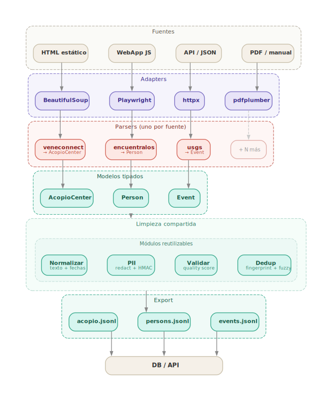

# VZLA_DEDUP - Módulo `scrapers`

Este paquete implementa una base ejecutable para el equipo de scrapers/cleaners.

El objetivo es convertir páginas, APIs, RSS o archivos manuales en **claims saneados, deduplicados y trazables**, evitando que datos sensibles entren a la salida operacional.

## Flujo



> Fuente editable: [`docs/pipeline.dot`](../docs/pipeline.dot) (Graphviz)

## Regla de seguridad

- No se commitean dumps reales.
- No se commitean PDFs reales, CSV reales, imágenes reales, teléfonos, cédulas, nombres de menores ni direcciones exactas.
- El raw solo puede guardarse en cuarentena externa/cifrada si existe autorización.
- La salida por defecto es saneada y deduplicada.

## Archivos principales

```text
scrapers/
├── cli.py                              # CLI principal
├── config/
│   ├── sources.demo.yaml               # demo offline con datos sintéticos
│   ├── sources.venezuela.starter.yaml  # starter para URLs/APIs reales
│   └── sources.custom.template.yaml    # plantilla para agregar páginas
├── pipelines/
│   └── run_pipeline.py                 # orquestador principal
├── sanitizers/
│   ├── pii_detector.py
│   ├── pii_redactor.py
│   └── pii_tokenizer.py
├── dedup/
│   └── fingerprint.py
├── outputs/
│   └── jsonl_writer.py
└── runtime_output/                     # salida local, ignorar en Git
```

## Instalación

Desde la raíz del repo:

```bash
python3 -m venv .venv
source .venv/bin/activate
pip install -r scrapers/requirements.txt
```

## Ejecutar demo offline

```bash
python -m scrapers.cli run --config scrapers/config/sources.demo.yaml
```

Salida esperada:

```text
scrapers/runtime_output/sanitized/claims.jsonl
scrapers/runtime_output/sanitized/documents.jsonl
scrapers/runtime_output/run_summary.json
```

## Ejecutar con fuentes starter

```bash
python -m scrapers.cli run --config scrapers/config/sources.venezuela.starter.yaml --limit 5
```

## Agregar nuevas páginas

1. Copiar `scrapers/config/sources.custom.template.yaml`.
2. Agregar fuente con `type: html_static`, `api_json`, `rss` o `manual_file`.
3. Ejecutar validación:

```bash
python -m scrapers.cli validate --config scrapers/config/sources.custom.yaml
```

4. Ejecutar pipeline:

```bash
python -m scrapers.cli run --config scrapers/config/sources.custom.yaml
```

## Salida operacional

Cada claim exportado contiene:

- `claim_id`
- `fingerprint`
- `source_id`
- `source_url`
- `claim_type`
- `description`
- `location_text`
- `confidence_score`
- `verification_status`
- `evidence_text`
- `fetched_at`

## Variables opcionales

```bash
export PII_HMAC_SECRET="cambiar-esto-por-secreto-real"
export SCRAPERS_KEEP_RAW="0"
```

`--keep-raw` conserva snapshots saneados para depuración local. El pipeline no escribe PII raw en claro.
